# Auto-Recovery After Motor Failure & Navigation Algorithms

> Research documentation for implementing failsafe motor-recovery and advanced
> navigation on the AR.Drone 2.0 (TI OMAP3530) platform.
>
> **Sources**: ETH Zurich Flying Machine Arena (Mark Mueller), RoboHub, TU Delft
> MAVLab, Hi-Link HLK-LD2450 datasheet, plus swarm-consensus reference material
> (8-equation series) supplied as images.
>
> Target: all algorithms run **on-drone** (600 MHz Cortex-A8, no ground station).

---

## Table of Contents

1. [Motor Failure: The Problem](#1-motor-failure-the-problem)
2. [Failsafe Recovery Algorithms](#2-failsafe-recovery-algorithms)
3. [Control Allocation Reconfiguration](#3-control-allocation-reconfiguration)
4. [Detection Pipeline](#4-detection-pipeline)
5. [State Machine: Failure → Recovery → Landing](#5-state-machine-failure--recovery--landing)
6. [Navigation Algorithms](#6-navigation-algorithms)
7. [Swarm Consensus: The 8 Equations](#7-swarm-consensus-the-8-equations)
8. [Vision-Based Navigation](#8-vision-based-navigation)
9. [HLK-LD2450 mmWave Radar Module](#9-hlk-ld2450-mmwave-radar-module)
10. [Integration Architecture for AR.Drone](#10-integration-architecture-for-ardrone)
11. [Implementation Roadmap](#11-implementation-roadmap)
12. [References](#12-references)

---

## 1. Motor Failure: The Problem

A quadcopter is an **underactuated, statically unstable** system with exactly 4
control inputs (thrust + 3 torques). Losing one propeller removes one input and
couples yaw into roll/pitch, so the vehicle **cannot hover normally** any more.

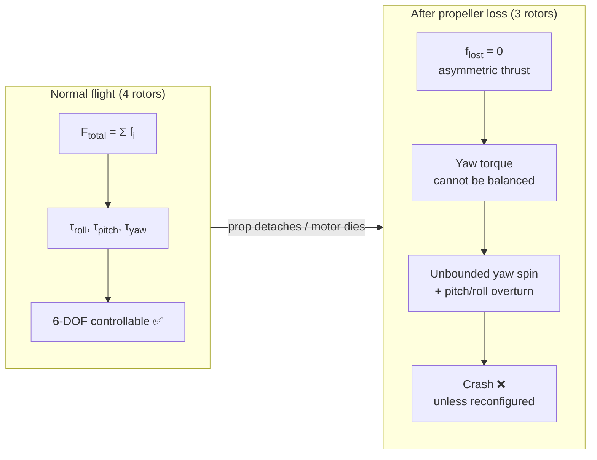

### Failure modes

| Mode | Symptom | Physics | Recoverable? |
|------|---------|---------|--------------|
| **Prop lost** (nut loose) | Thrust → 0 on one arm, drag from stub | Yaw spin-up, then overturn | ✅ Yes (ETH demo) |
| **Motor seized** | Rotor stopped, large drag + imbalance | Strong yaw + asymmetric thrust | ✅ Yes |
| **ESC / power loss** | Same as seized but no restart | Same | ✅ Yes |
| **2 motors lost** | Two thrust vectors gone | Very limited authority | ⚠️ Partial (spinning flight) |
| **3 motors lost** | Single thrust vector | Only altitude-ish control | ❌ No (parachute/land fast) |

---

## 2. Failsafe Recovery Algorithms

### 2.1 ETH Zurich — Spinning-flight failsafe (Mark Mueller, IDSC)

**Core idea**: once a propeller is lost the vehicle *will* rotate continuously.
Instead of fighting the spin, **exploit it**:

> Control the *direction of the rotation axis* and the *total average thrust*.
> Averaged over one spin revolution, the thrust vector acts along the rotation
> axis — so controlling that axis's direction = controlling acceleration = the
> vehicle can still track position.

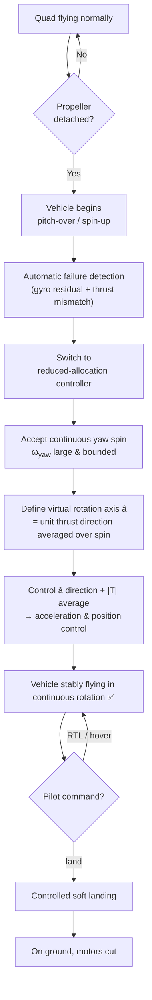

**Key facts from the RoboHub / ETH write-up:**

- Detection is **fully automatic**; recovery happens without operator input.
- Uses only **rate gyroscopes** (onboard IMU) — no motion-capture needed for the
  2014 hand-piloted version. LEDs mark a *virtual yaw* for the pilot; a
  magnetometer or better algorithms could replace them.
- Works for loss of **1, 2, or 3 propellers** in principle.
- Even if remaining thrust < weight, still useful: **minimize ground impact
  velocity** or **steer away from people / water**.
- Patent-pending at time of publication (ETH Flying Machine Arena).

### 2.2 Mathematical sketch of spinning flight

Over one revolution the instantaneous body-frame thrust averages out. Define the
averaged specific force:

```
f_avg = (1/T) ∫₀ᵀ R(t) · [0,0,T(t)]ᵀ dt  ≈  T̄ · â
```

Position control then reduces to choosing `â` (two DOF) and `T̄` (one DOF):

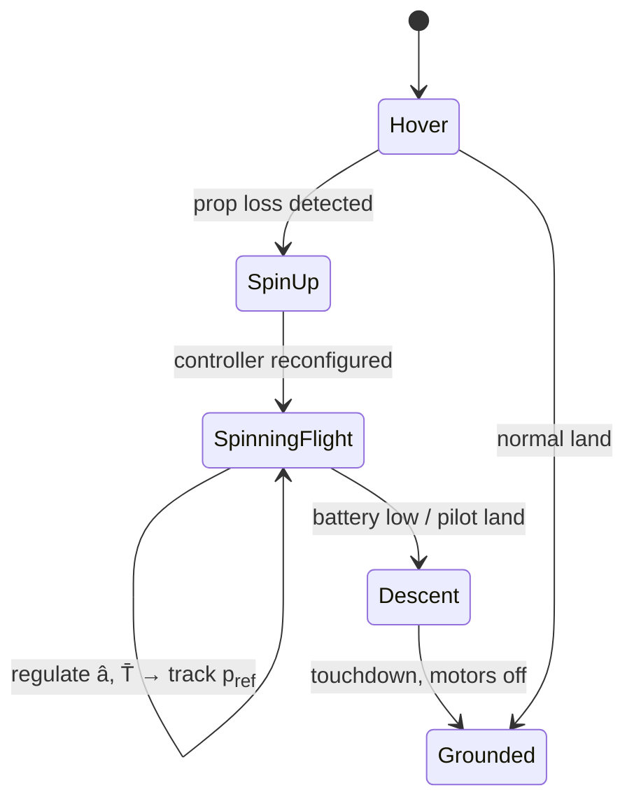

### 2.3 Alternative strategies in literature

| Strategy | Requirement | Pros | Cons |
|----------|-------------|------|------|
| **Spinning flight (ETH)** | 3 remaining props, gyro | No extra hardware, keeps altitude | Vehicle spins, video unusable |
| **Tricopter reallocation** | Loss of *thrust* but free rotor (or hex) | No spin, keeps camera stable | Quad loses yaw authority entirely |
| **Geometric controller switch** | Good state estimation | Rigorous, tracks trajectories | Needs accurate attitude under failure |
| **Reconfigurable mixer (rank-1 update)** | Underactuated solve | Works on hex/octo, adaptive | Computationally heavier |
| **Parachute / ballistic** | Hardware | Last-resort | No control at all |

---

## 3. Control Allocation Reconfiguration

Normal quad mixer (X-configuration) maps `[T, τ_roll, τ_pitch, τ_yaw]` to 4
motor commands via allocation matrix `M`:

```
[u₁ u₂ u₃ u₄]ᵀ = M · [T τ_φ τ_θ τ_ψ]ᵀ ,   M is 4×4
```

When motor *k* is lost, its row is removed → `M'` becomes **3×4 (rank ≤ 3)**.
The system is underdetermined: there are infinitely many solutions, so we pick
the one minimizing control effort (weighted pseudo-inverse), or accept that one
axis (usually yaw) is dropped.

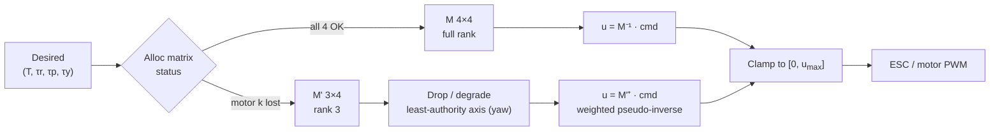

**Hexacopter case (MDPI Actuators 2021)**: 1, 2 or 3 motor failures give 7
recoverable scenarios; a redefined allocation matrix restores *limited*
controllability **without changing the outer-loop gains**, so the pilot still
gets familiar handling qualities for an emergency landing.

**Rank-1 update adaptive allocation (EuroGNC 2024)**: when a motor degrades,
`M` changes only by a rank-1 term → update the pseudo-inverse cheaply
(`O(n²)` instead of `O(n³)`), suitable for an IMX/OMAP-class CPU.

---

## 4. Detection Pipeline

Failure must be detected in **< 100 ms** before the vehicle overturns.

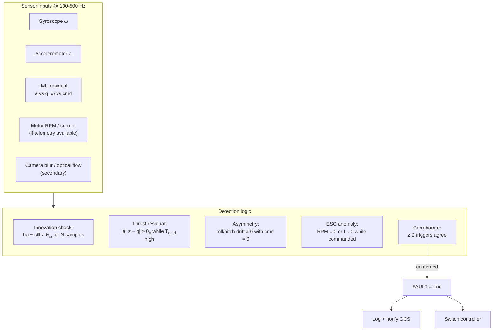

Detection heuristics:

1. **Gyro residual** — commanded rates ≈ 0 but measured rates grow ⇒ unmodeled
   torque (lost prop drag / imbalance).
2. **Specific-force residual** — `a` deviates from `-g·e₃` while collective
   thrust is high.
3. **ESC feedback** (if available on AR.Drone) — RPM collapse or current spike.
4. **Optical-flow sanity** — sudden large un-commanded image rotation.

Require **2-of-N agreement** over ~20–50 ms to avoid false positives from
vibration or aggressive maneuvering.

---

## 5. State Machine: Failure → Recovery → Landing

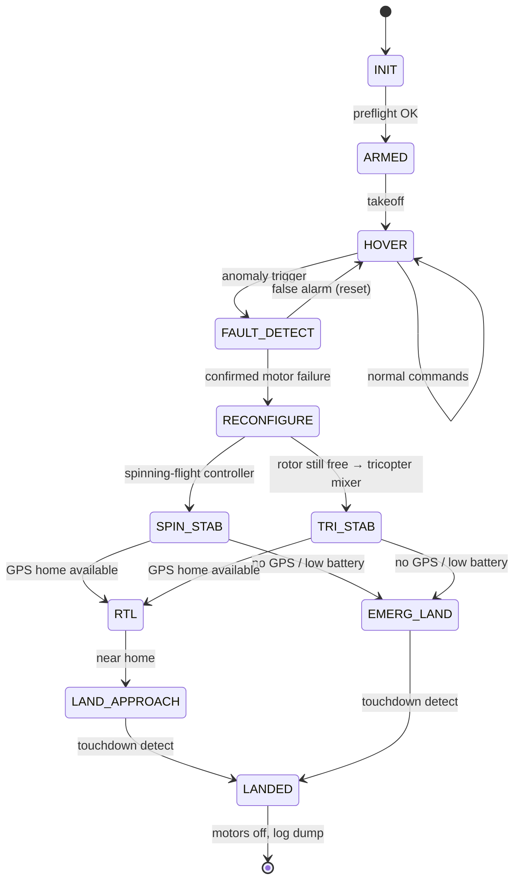

`RECONFIGURE` actions:

1. Zero the yaw PID/ADRC term for the dead axis (or hand it to the spin
   controller).
2. Rebuild allocation matrix `M'`.
3. Reset integrators (avoid windup against an impossible setpoint).
4. Lower attitude bandwidth (`wc` ↓) — reduced authority ⇒ gentler gains.
5. Optionally raise observer bandwidth (`wo` ↑) to track the new plant faster.

> This is exactly where our **ADRC** design shines: `b0` (plant gain) changes
> when a motor dies, so re-tuning is `b0 ← b0 · (3/4)` and re-selecting `wc`.
> See `src/flight/adrc.c` → `adrc_from_pid()`.

---

## 6. Navigation Algorithms

Navigation = **where am I** (state estimation) + **where to go** (planning) +
**how to get there** (control). The relevant families for an on-drone,
CPU-constrained implementation:

```mermaid
flowchart TD
    NAV["Navigation stack"] --> EST["State estimation"]
    NAV --> PLAN["Path / motion planning"]
    NAV --> AVOID["Obstacle avoidance"]
    NAV --> CONS["Multi-agent consensus"]

    EST --> EST1["EKF / complementary<br/>IMU + GPS + baro"]
    EST --> EST2["Visual odometry<br/>FAST + LK + 8-pt"]
    EST --> EST3["Optical flow<br/>SAD block matching"]

    PLAN --> P1["GPS waypoint<br/>(Haversine, RTH)"]
    PLAN --> P2["Bug / reactive<br/>(mapless)"]
    PLAN --> P3="Potential field"]

    AVOID --> A1["Looming / time-to-collision"]
    AVOID --> A2["Flow-field divergence"]
    AVOID --> A3["Radar ranging (LD2450)"]
    AVOID --> A4["Depth / stereo"]

    CONS --> C1["Laplacian consensus"]
    CONS --> C2["Formation control"]
    CONS --> C3["Follow-me / flocking"]

    EST -->|feedback| CTRL["Flight controller (PID / ADRC)"]
    PLAN --> CTRL
    AVOID --> CTRL
    CONS --> CTRL
```

### 6.1 Algorithm selection matrix (for AR.Drone-class hardware)

| Algorithm | Compute | Sensors | Outdoor | Indoor | Notes |
|-----------|---------|---------|---------|---------|-------|
| GPS waypoint + RTH | Low | GPS + IMU | ✅ | ❌ | Already in `navigation/gps.c` |
| Optical-flow flow-field | Low | Downward cam | ⚠️ texture | ✅ | Our `flow_stage1` |
| FAST+LK visual odometry | Med | Front cam + IMU | ⚠️ | ✅ | Our `visual_odometry.c` |
| Looming / TTC avoidance | Low | Front cam | ✅ | ✅ | Our `obstacle.c` |
| Hough line / lane follow | Med | Front cam | ✅ | ⚠️ | Our `line_detect.c` |
| mmWave radar ranging | Very low | LD2450 | ✅ | ✅ | Works in dark/dust/smoke |
| Full VIO / SLAM | High | Cam + IMU | ✅ | ✅ | Too heavy for 600 MHz |
| Laplacian consensus | Low | Comms + GPS | ✅ | ⚠️ | Swarm extension |

### 6.2 Reactive navigation (TU Delft MAVLab style)

The MAVLab philosophy: **cheap, reactive, biologically-inspired** beats heavy
SLAM on small drones.

- **Optical flow as control input** — divergence of the flow field ∝ proximity;
  keep flow symmetric ⇒ keep equal distance to obstacles on both sides
  (Srinivasan honeybee-inspired).
- **Gate / feature detection** at high rate (20 Hz on a Bebop CPU) instead of
  full SLAM.
- **Bug algorithms** (Frustumbug, 2023) — mapless wall-following using stereo.
- **End-to-end neural G&C** (Science Robotics 2024) — guidance+control networks
  with online system identification to close the reality gap.

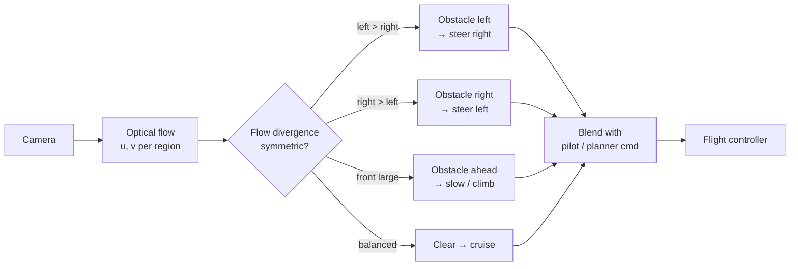

---

## 7. Swarm Consensus: The 8 Equations

The reference images describe swarm coordination as **eight equations**.
Summarized and formalized here — relevant for our ⚪ "Swarm via 4G mesh"
roadmap item.

### Step 1 — Who can you see? (Sensing / adjacency)

```
a_ij = 1   if  ‖x_i − x_j‖ < r     else  0
```

Directed/undirected sensing graph within radius `r`.

### Step 2 — Move toward your neighbours (Consensus)

```
ẋ_i = − Σ_j a_ij (x_i − x_j)
```

Each agent drifts to the average of its neighbours.

### Step 3 — The whole swarm, one matrix (Laplacian)

```
ẋ = −L x ,      L = D − A
```

`A` = adjacency, `D` = degree matrix (`D_ii = Σ_j a_ij`).

### Step 4 — More links ⇒ faster agreement (Algebraic connectivity)

```
‖x(t) − x̄‖ ≤ e^(−λ₂ t) · ‖x(0) − x̄‖
```

`λ₂` = Fiedler eigenvalue of `L`. Larger `λ₂` ⇒ exponential convergence faster.

### Step 5 — Keep your distance (Separation / collision avoidance)

```
u_i^sep = Σ_j k_s (r_s − d_ij) · (x_i − x_j) / d_ij      for d_ij < r_s
```

Repulsive potential when closer than safe radius `r_s`.

### Step 6 — Agree on a shape (Formation consensus)

```
ẋ_i = − Σ_j a_ij [ (x_i − x_j) − (δ_i − δ_j) ]
```

`δ_i` = desired offset of agent `i` from formation centroid. Agents converge to
a rigid shape rather than a point.

### Step 7 — Move the shape, not the drones (Time-varying formation)

```
x*_i(t) = c(t) + R(ω t) · δ_i
```

Centroid `c(t)` follows a trajectory while `R(ωt)` rotates the formation.

### Step 8 — Lose one, keep flying (Fault tolerance)

```
λ₂(L) > 0  ⟺  x_i(t) → x̄    (consensus still reached)
```

If removing a node leaves the graph connected (`λ₂ > 0`), the swarm survives the
loss — the multi-agent analogue of our single-drone motor-failure tolerance.

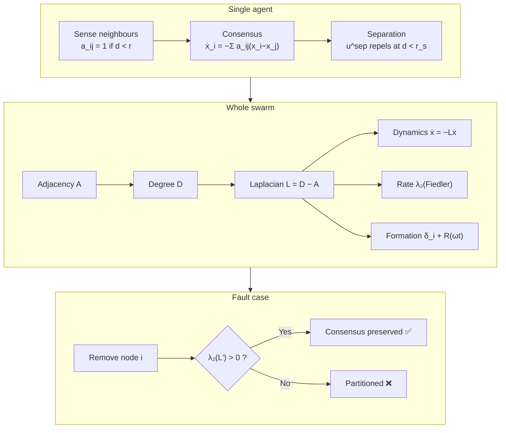

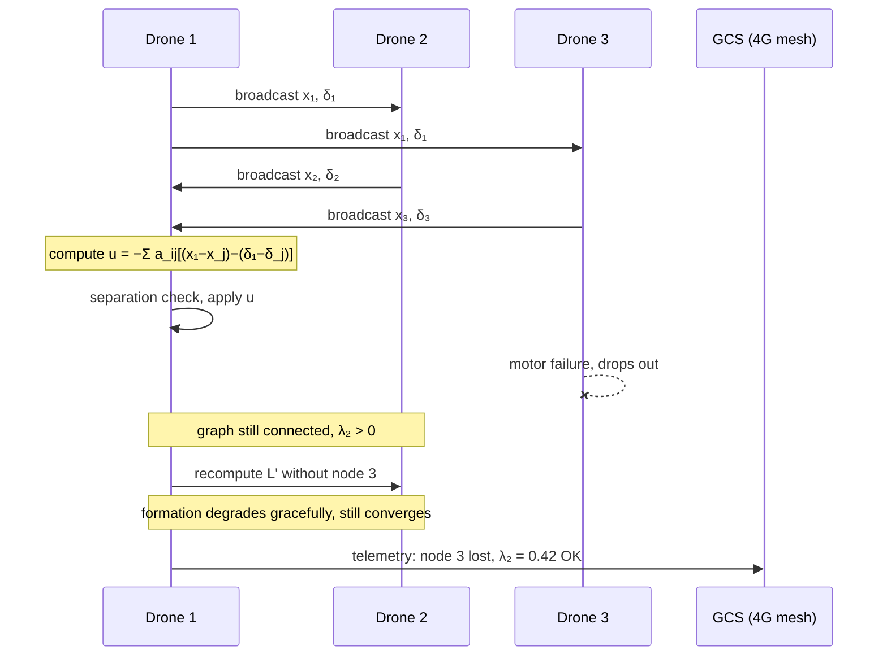

---

## 8. Vision-Based Navigation

Our existing pipeline already covers the core of this:

| Stage | File | Purpose |
|-------|------|---------|
| Grayscale capture | `src/vision/video_capture.c` | V4L2 UYVY→NV12/gray |
| Stage 1 optical flow | `src/vision/flow_stage1.c` | SAD block matching |
| Obstacle detection | `src/vision/obstacle.c` | Looming, asymmetry, vertical line |
| Visual odometry | `src/vision/visual_odometry.c` | FAST-9 + LK + 8-pt + SVD |
| Line/lane detection | `src/vision/line_detect.c` | Sobel + Canny + Hough + curves |

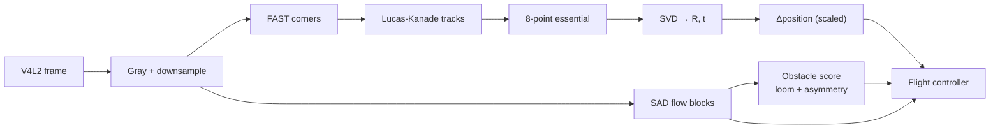

**Gap to close:** metric scale for VO (needs baro/GPS/altitude fusion), and
loop-closure-free drift bounding for indoor RTH.

---

## 9. HLK-LD2450 mmWave Radar Module

### 9.1 What it is

The **Hi-Link HLK-LD2450** is a small **24 GHz FMCW millimetre-wave radar**
module for **motion-target tracking**: it reports the **(x, y) position, speed,
distance, angle and resolution of up to 3 moving targets** over a UART.

> ⚠️ Note: some vendors label it "60 GHz"; the **official datasheet says
> 24 GHz ISM (24.000–24.250 GHz)**. It is a *tracking* radar (LD2450), unlike
> the presence-only LD2410/LD2411/LD2420 family.

### 9.2 Specifications

| Parameter | Value |
|-----------|-------|
| Frequency band | 24.000 – 24.250 GHz (ISM) |
| Modulation | FMCW |
| Antenna | 1 TX / 2 RX microstrip |
| Power supply | DC 5 V (4.5–5.5 V), **> 200 mA** |
| Average current | ~120 mA (≈ 0.6 W) |
| Detection range | 0.75 m – **6 m** |
| Detection angle | **±60° azimuth**, ±35° elevation |
| Max tracked targets | **3 simultaneously** |
| Output per target | x (mm), y (mm), speed (mm/s), resolution |
| Data refresh rate | **10 Hz** (every 100 ms) |
| Interface | **UART, 256000 baud, 8N1** (logic 3.3 V) |
| Module size | **15 × 44 mm** |
| Operating temp | −40 °C … +85 °C |
| Certifications | FCC / CE exempt (license-free) |

### 9.3 UART frame format

Reported at 10 fps. Frame layout (from the Hi-Link instruction manual):

```
┌────────┬──────┬───────────────────────────────┬────────┐
│ Header │ Cmd  │  Target data (up to 3)        │ Footer │
│ AA FF  │ 03   │  target#1, #2, #3             │ 55 CC  │
│ 03 00  │       │  x_lo x_hi y_lo y_hi         │        │
│        │       │  speed_lo speed_hi res_lo res_hi │    │
└────────┴──────┴───────────────────────────────┴────────┘
   4 B     1 B          8 B per target × 3         2 B
   total frame = 30 bytes
```

- Coordinates are **signed little-endian**, `y` = range toward target,
  `x` = lateral offset; `y ∈ [0, 6000] mm`.
- Some firmwares expose `angle` (deg) and `distance` (mm) derived from `(x,y)`.

> **Firmware note**: ESPHome requires `V2.02.23090617` or newer for full
> integration; update via the *HLKRadarTool* app (BLE OTA).

### 9.4 Data-flow / parsing pipeline

```mermaid
flowchart LR
    HW["LD2450<br/>24 GHz FMCW"] --> RF["Range-FFT<br/>+ CFAR detect"]
    RF --> DBF["2 RX beamforming<br/>→ azimuth angle"]
    DBF --> TRACK["Multi-target tracker<br/>up to 3 targets"]
    TRACK --> SER["UART 256000 8N1<br/>10 fps, 30 B frames"]
    SER --> PARSE["Frame parser<br/>sync on AA FF 03 00"]
    PARSE --> CHK["CRC/footer check<br/>55 CC"]
    CHK --> STORE["target[3]{x,y,v,res}"]
    STORE --> FUSE["Sensor fusion<br/>with flow / baro / VO"]
    FUSE --> APP["Drone applications ↓"]
```

### 9.5 Drone applications for LD2450

This is the interesting part: a **6 m, 3-target, 10 Hz, ~0.6 W, 15×44 mm**
radar is a genuinely useful sensor on a small drone — and unlike a camera it
works in **darkness, dust, smoke and rain**, and it is unaffected by motion blur
and lighting changes.

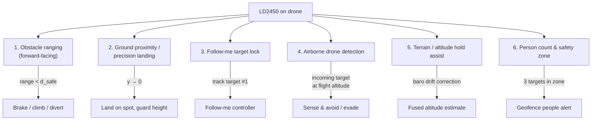

#### Application details

1. **Forward obstacle ranging (complements vision)**
   Camera flow gives *relative* proximity; radar gives *metric* range with no
   texture requirement. Fuse: `d_safe = f(flow_div, radar_range)`.

2. **Ground proximity & precision landing**
   Mount facing down: `y` = height above ground. Radar is robust where
   downward optical flow fails (water, featureless floor, darkness).

3. **Follow-me / person tracking**
   The module already outputs a tracked `(x,y,v)` — no onboard CV needed.
   Feed target position into the position controller for follow-me mode
   (replaces or assists GPS follow).

4. **Airborne drone detection (ADS-B-like, passive)**
   Our roadmap already includes RTL-SDR drone detection; a 24 GHz radar gives a
   **range+velocity** cue for other UAVs/people inside 6 m — a last-resort
   sense-and-avoid layer.

5. **Altitude-hold assist**
   FMCW range is independent of barometric drift; fuse as a third altitude
   source when `range < 6 m`.

6. **Safety zone / people counting**
   Up to 3 targets ⇒ detect bystanders near takeoff/landing pad.

### 9.6 Integration on AR.Drone 2.0

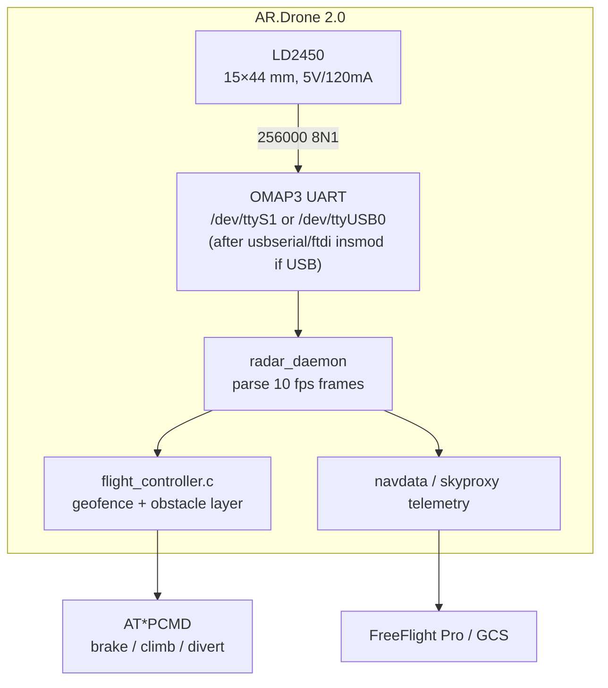

**Practical notes**

- **Power**: budget ~0.6 W (120 mA @ 5 V). AR.Drone's battery/5 V rail can
  supply this, but verify headroom under motor load.
- **UART rate**: 256000 baud is unusual — the OMAP UART supports it; if going
  through a USB-serial adapter ensure the bridge supports ≥ 256000 (FTDI/CP210x
  do; some PL2303 revs don't). We already cross-compile `ftdi_sio`, `cp210x`,
  `pl2303` for this reason.
- **Vibration**: mount with foam/foam tape — mmWave is fairly vibration-tolerant
  but strong airframe vibration can raise the noise floor.
- **Boresight**: ±60° azimuth is wide — good for obstacle fan, but mount
  forward and pitch down for landing use.
- **Frame rate**: 10 Hz is enough for ranging at drone speeds if we add
  extrapolation with IMU velocity (predict `range(t+Δ)` using `v_radial`).
- **3 targets**: assign tracks with a simple nearest-neighbour / Hungarian
  filter across frames to keep target IDs stable.

### 9.7 Minimal frame parser (C, sketch)

```c
#define LD2450_HDR "\xAA\xFF\x03\x00"
#define LD2450_FTR "\x55\xCC"
#define LD2450_FRAME_LEN 30
#define LD2450_NTARGETS 3

typedef struct { int16_t x, y; int16_t speed; uint16_t res; } ld2450_target_t;

/* little-endian signed 16-bit */
static int16_t s16(const uint8_t *p) { return (int16_t)(p[0] | (p[1] << 8)); }

int ld2450_parse(const uint8_t *buf, size_t n, ld2450_target_t *out, int *count)
{
    /* find header AA FF 03 00 */
    for (size_t i = 0; i + LD2450_FRAME_LEN <= n; i++) {
        if (buf[i]==0xAA && buf[i+1]==0xFF && buf[i+2]==0x03 && buf[i+3]==0x00 &&
            buf[i+LD2450_FRAME_LEN-2]==0x55 && buf[i+LD2450_FRAME_LEN-1]==0xCC) {
            *count = 0;
            for (int t = 0; t < LD2450_NTARGETS; t++) {
                const uint8_t *d = buf + i + 6 + t * 8;   /* hdr(4)+cmd(2) */
                out[*count].x     = s16(d);
                out[*count].y     = s16(d + 2);
                out[*count].speed = s16(d + 4);
                out[*count].res   = (uint16_t)(d[6] | (d[7] << 8));
                if (out[*count].y != 0)   /* nonzero range ⇒ valid track */
                    (*count)++;
            }
            return LD2450_FRAME_LEN;
        }
    }
    return 0;
}
```

> Byte offsets should be verified against the exact firmware version of your
> module — confirm with the HLKRadarTool visualizer before trusting them.

### 9.8 LD2450 vs. alternatives

| Module | Freq | Range | Output | Best for |
|--------|------|-------|--------|----------|
| **LD2450** | 24 GHz | 6 m | 3 targets x,y,v @10 Hz | **Tracking, follow-me, ranging** |
| LD2410/2411 | 24 GHz | presence | binary presence | Indoor occupancy only |
| LD2420 | 24 GHz | 8 m | presence + motion | Larger presence zone |
| TFmini LiDAR | 905 nm | 12 m | 1 range @100 Hz | **Precise altitude** (needs light) |
| ToF VL53L1 | 940 nm | 4 m | range @50 Hz | Close landing, very light |
| Ultrasonic | 40 kHz | 4 m | range | Cheap altimeter, noisy |

**Recommendation**: LD2450 is best used as a **complement to (not replacement
for)** the downward ToF/LiDAR altimeter and the forward camera — it uniquely
adds **multi-target tracking + all-weather ranging** at very low cost.

---

## 10. Integration Architecture for AR.Drone

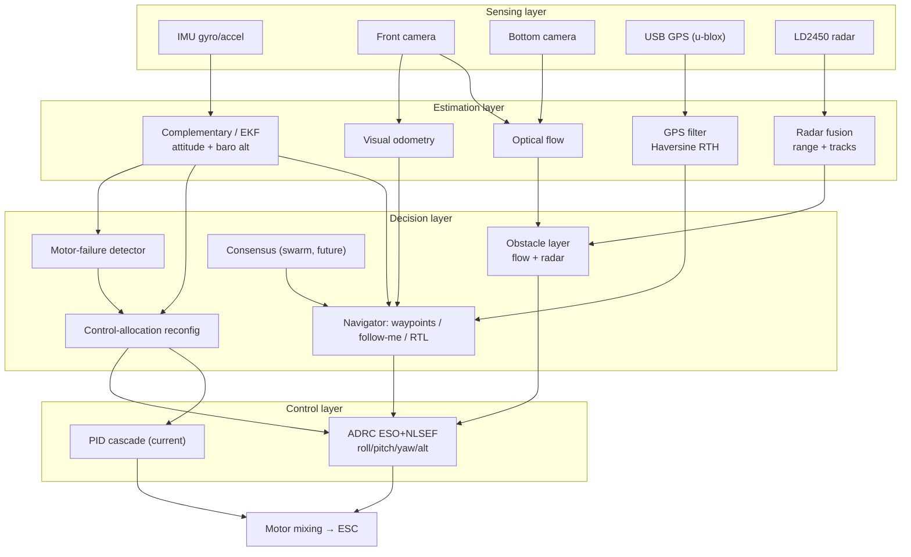

---

## 11. Implementation Roadmap

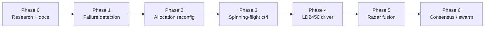

| Phase | Deliverable | Files | Effort |
|-------|-------------|-------|--------|
| **0** | This document | `docs/auto-recovery-navigation.md` | ✅ done |
| **1** | Motor-failure detector (gyro residual + 2-of-N vote) | `src/flight/fault_detect.c/.h` (new) | S |
| **2** | Reconfigurable mixer: drop row from `M`, pseudo-inverse, integrator reset, `b0 ← b0·¾` for ADRC | `src/flight/flight_controller.c`, `src/flight/adrc.c` | M |
| **3** | Spinning-flight controller (ETH): virtual axis + averaged thrust | `src/flight/spin_recovery.c/.h` (new) + extend `quad_sim` | L |
| **4** | LD2450 UART driver @256000, frame parser, track IDs | `src/sensors/ld2450.c/.h` (new) + `src/tests/test_ld2450.c` | S |
| **5** | Fuse radar range into obstacle/landing/geofence layers | `src/vision/obstacle.c`, `src/flight/flight_controller.c` | M |
| **6** | Laplacian consensus over 4G mesh for multi-drone | `src/network/consensus.c/.h` (new) | L |

**Testing strategy**

1. Extend `tools/simulator/quad_sim.c` with a `--motorfail <idx> <t>` flag to
   simulate propeller loss and validate detection + reconfiguration + spinning
   flight **before touching hardware**.
2. Unit tests in `tools/simulator/test_quad_adrc.c` style → add
   `test_fault_recovery.c`.
3. Bench test: prop removed, drone held / on tether, verify detection latency
   (<100 ms) and controller handoff.
4. LD2450: `test_ld2450` prints frames; cross-check against HLKRadarTool app.

---

## 12. References

**Motor failure / failsafe**

- M. Mueller, *"Quadrocopter failsafe algorithm: recovery after propeller
  loss"*, RoboHub, 04 Mar 2014 —
  https://robohub.org/quadrocopter-failsafe-algorithm-recovery-after-propeller-loss/
- ETH Zurich IDSC / Flying Machine Arena —
  http://flyingmachinearena.org/ , https://www.idsc.ethz.ch/Research/DAndrea/Flying_Machine_Arena
- ETH News, *"New algorithm makes quadrocopters safer"*, Dec 2013 —
  https://ethz.ch/en/news-and-events/eth-news/news/2013/12/new-algorithm-makes-quadrocopters-safer.html
- *"Analysis and Management of Motor Failures of Hexacopter in Hover"*,
  Actuators 10(3):48, 2021 — https://www.mdpi.com/2076-0825/10/3/48
- *"Nonlinear control of quadrotor UAV under rotor failure for robust trajectory
  tracking"*, Scientific Reports, 2025 — https://www.nature.com/articles/s41598-025-26264-x
- Li et al., *"Rank one update-based efficient adaptive control allocation for
  multicopter"*, EuroGNC 2024 —
  https://eurognc.ceas.org/archive/EuroGNC2024/pdf/CEAS-GNC-2024-083.pdf
- Ergöçmen, *"Reconfigurable Fault-Tolerant Dynamic Control Allocation"*, 2025
- Lopez et al., *"Development of a Reconfigurable Multicopter Flight Dynamics
  Model from Flight Data"*, AHS 2019 —
  https://www.sjsu.edu/researchfoundation/docs/AHS_2019_Lopez.pdf
- NASA NTRS, *"Handling Qualities Considerations in Control Allocation for
  Multicopters"* — https://ntrs.nasa.gov/api/citations/20220004968/

**Navigation**

- TU Delft MAVLab — https://www.tudelft.nl/en/ae/organisation/departments/control-and-operations/control-and-simulation/research/micro-aerial-vehicle-lab
- TU Delft Drones — https://www.tudelft.nl/en/innovation-impact/business-collaboration/robotics/drones
- mavlab.tudelft.nl (research + theses: Frustumbug, Modular NN nano drone racing)
- *"Autonomous drone race: computationally efficient vision-based navigation and
  control strategy"*, arXiv:1809.05958 —
  https://arxiv.org/html/1809.05958v2
- *"A survey on vision-based UAV navigation"*, Geo-spatial Inf. Processing,
  2018 — https://www.tandfonline.com/doi/full/10.1080/10095020.2017.1420509
- *"Vision-Based Obstacle Avoidance Strategies for MAVs Using Optical Flow"*,
  2019 — https://pmc.ncbi.nlm.nih.gov/articles/PMC6604071
- Zingg et al., *"MAV Navigation through Indoor Corridors Using Optical Flow"*,
  ICRA 2010 — https://rpg.ifi.uzh.ch/docs/ICRA10_zingg.pdf
- *"End-to-end neural network based optimal quadcopter control"*, Science
  Robotics, Jun 2024 (MAVLab + ESA ACT)
- Swarm consensus: 8-equation reference series (supplied images, Steps 1–8)

**HLK-LD2450**

- Hi-Link official product page —
  https://www.hlktech.net/index.php?id=1157
- HLK-LD2450 Instruction Manual (PDF) —
  https://www.tinytronics.nl/product_files/006000_HLK-LD2450-Instruction-Manual.pdf
- ESPHome LD2450 component — https://esphome.io/components/sensor/ld2450
- Rust `ld2450` crate — https://docs.rs/ld2450/latest/ld2450
- Arduino library — https://github.com/RBEGamer/HLK-LD2450
- ShillehTek manual (specs table) —
  https://shillehtek.com/blogs/shillehtek-product-manuals/hlk-ld2450-24ghz-mmwave-radar-human-body-tracking-sensor-module-manual
- LaskaKit product page —
  https://www.laskakit.cz/en/radarovy-senzor-pohybu-hlk-ld2450-fmcw-24ghz-do-8m-pro-detekci-lidske-pritomnosti
- Home Assistant comparison thread —
  https://community.home-assistant.io/t/ld2410c-vs-2410b-vs-ld2410s-vs-2411-vs-hlk-ld2420-vs-ld2450/652599
