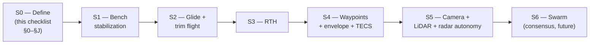

# ESP32 Flying Wing — Definition Checklist

> **Living document.** We define the airplane item by item and iterate.
> Every open box is a decision still pending; every `[x]` is locked.
> Related: [`docs/algorithm-mapping.md`](docs/algorithm-mapping.md) (which
> AR.Drone algorithms transfer) · `../docs/auto-recovery-navigation.md`
> (research sources).

---

## How to use this checklist

| Mark | Meaning |
|------|---------|
| `[ ]` | **Open** — needs a decision |
| `[x]` | **Decided / done** |
| `[~]` | Partially decided / needs validation |

Each section ends with **"Blockers for next phase"** — the items that must
close before we can move on. We iterate section by section.

**Legend for priority**: `P0` = required to fly at all · `P1` = required for
RTH · `P2` = required for autonomous phase 2 · `P3` = future / swarm

---

## Status snapshot — 2026-09-22 (iteration 2)

**Implemented in firmware** (code exists, needs bench/SIL validation):

| Area | State |
|------|-------|
| Elevon mixing + differential (D1/D2) | ✅ code written — **signs NOT yet bench-validated** |
| ADRC-lite (ESO + NLSEF) + `b0 ∝ q` scheduling (F1) | ✅ initial — needs SIL gain ID |
| Envelope protection: stall / bank / Vne / g (F3) | ✅ code written — needs SIL test |
| L1 guidance (G2) | ✅ chosen + implemented |
| Wing-specific RTH + loiter + glide + flare (G4) | ✅ sequence written — **not SIL-tested yet** |
| Geofence circle + altitude (G5) | ✅ implemented (independent layer) |
| Failsafe FSM + preflight gate (H1/H6) | ✅ states + thresholds defined |
| `config.h` parameter layer (E5) | ✅ all gains/limits centralized |
| Host unit tests (J2 / E6) | ✅ **251 assertions passing** (111 core + 140 config/RC/sensor) |
| LD2450 frame parser + track matcher (C7) | ✅ real parser — **verify offsets vs firmware** |
| GPS driver: u-blox 6 UART1 + NMEA/UBX (C4) | ✅ real driver — GGA/RMC @ 4 Hz, byte-stream parser + UBX config, tested |
| Pin map (B2) | ✅ written into `config.h` — **still needs bench verification** |
| IMU board abstraction (C1/C2/C3) | ✅ `#if`-selected **GY-91 / GY-87** drivers + calibration |
| RC input: SBUS + Spektrum decode (H2) | ✅ decoders + mapping — **needs receiver bench check** |
| Persisted settings + CRC (B/E5) | ✅ NVS-backed blob, validate/clamp on load |
| WiFi config portal (I5/I4-lite) | ✅ HTTP form + JSON API, saves to NVS |
| Telemetry research (I1) | 📄 `docs/rc-and-telemetry.md` — options A–E ranked |

**Still open / blocking**:
- **§A airframe numbers** (A3 CG, A6 `V_stall`) — *physical blocker, needs the wing*
- Real **LiDAR (C6) driver** is a stub — must land before §C closes
- **J1 wing SIL plant model** not started
- Battery ADC (B4/H3) — hardcoded placeholder
- **Spektrum byte-2 status layout** — two sources disagree, bench-validate against a real receiver

---

## 0. Locked baseline ✅ (from initial discussion)

- [x] **Airframe type** — *Ala voladora (flying wing)*, elevons only
- [x] **Sensors** — IMU + barómetro + GPS + magnetómetro + LiDAR (TFmini) / radar (HLK-LD2450)
- [x] **Autonomy phase 1** — *estabilización + RTH*
- [x] **Autonomy phase 2** — vuelo autónomo con cámara + LiDAR + radar
- [x] **Propulsion** — eléctrico con ESC (throttle PWM)

---

## A. Airframe & mechanics (P0)

- [ ] **A1. Specific wing model / planform**
  - [ ] Span `b` (mm): ______
  - [ ] Chord `c` (mm): ______
  - [ ] Wing area `S` (m²): ______
  - [ ] Aspect ratio `AR = b²/S`: ______
  - [ ] Sweep angle (deg): ______
- [ ] **A2. Mass budget**
  - [ ] Empty weight (g): ______
  - [ ] Battery weight (g): ______
  - [ ] Payload (ESP32 + sensors + GPS + LiDAR) (g): ______
  - [ ] MTOW (g): ______
  - [ ] Wing loading `W/S` (g/dm²): ______ ← **drives stall speed**
- [ ] **A3. Center of gravity (CG)**
  - [ ] CG position (% chord): ______ ← *single most critical build value*
  - [ ] CG measurement method (hole-in-wing / CG jig): ______
  - [ ] CG range before/after acceptable: ______
- [ ] **A4. Control surfaces**
  - [ ] Elevon span (mm): ______
  - [ ] Elevon chord ratio: ______
  - [ ] Deflection limits — pitch (deg): +____ / −____
  - [ ] Deflection limits — roll (deg): +____ / −____
  - [ ] Servos: model, torque (kg·cm), speed (s/60°), voltage: ______
  - [ ] Mechanical throws measured at each surface: [ ] validated on bench
  - [ ] Pushrod geometry / endpoints calibrated in firmware: [ ]
  - [ ] Dihedral / washout / winglets present? (affects yaw): [ ] defined
  - [ ] Adverse-yaw mitigation: [ ] elevon differential chosen, value = ____
- [ ] **A5. Propulsion**
  - [ ] Motor KV / size: ______
  - [ ] Prop size/pitch: ______
  - [ ] ESC amps / protocol (PWM / Oneshot / DShot): ______
  - [ ] Battery cell count / capacity / C-rating: ______
  - [ ] Estimated max thrust-to-weight: ______
  - [ ] Expected cruise current (A): ______
- [ ] **A6. Estimated performance envelope** *(feeds envelope protection N4)*
  - [ ] `V_stall` (m/s): ______ ← **measure in flight test, not guess**
  - [ ] `V_min = 1.3 · V_stall` (m/s): ______
  - [ ] `V_cruise` (m/s): ______
  - [ ] `V_ne` never-exceed (m/s): ______
  - [ ] Max bank `φ_max` (deg): ______
  - [ ] Load factor limit `n_max` (+ / − g): ______
  - [ ] Turn radius at cruise & `φ_max`: `R = V²/(g·tanφ)` = ______ m
  - [ ] Glide ratio (L/D) estimated: ______
  - [ ] Service ceiling needed (m AGL): ______

> **Blockers for §A**: A3 (CG), A6 (`V_stall`, `V_ne`, `φ_max`) — nothing
> autonomous can be tuned without them.

---

## B. ESP32 hardware & wiring (P0)

- [ ] **B1. Board selection**
  - [ ] Variant: [ ] ESP32-WROOM-32 DevKit · [ ] ESP32-S3 · [ ] ESP32-C6 · [ ] other: ____
  - [ ] Flash size (MB): ______
  - [ ] PSRAM present? [ ] yes [ ] no
  - [ ] ADC pins available & not used by PWM: [ ] mapped
- [x] **B2. Pin assignment (must be written down!)** — *draft in `config.h`, bench-verify*

  | Function | Bus | GPIO | Status |
  |----------|-----|------|--------|
  | Left elevon servo | LEDC ch0 | **25** | [x] defined |
  | Right elevon servo | LEDC ch1 | **26** | [x] defined |
  | ESC throttle | LEDC ch2 | **27** | [x] defined |
  | IMU + baro + mag (GY-91 / GY-87) | I2C | **21 / 22** (SDA/SCL) | [x] defined |
  | IMU (SPI variant, reserved) | SPI | CS **5**, SCK 18, MISO 19, MOSI 23 | [ ] not used yet |
  | GPS (u-blox 6 / NEO-6M) | UART1 | RX **13** / TX **14** | [x] defined |
  | LiDAR (TFmini) | UART / soft-serial | RX **34** (input-only) | [x] defined |
  | HLK-LD2450 radar | UART | RX **35** | [x] defined |
  | Battery voltage divider | ADC1 | **32** | [x] defined (no ADC code yet) |
  | Current sensor (optional) | ADC1 | ____ | [ ] |
  | Status LED | GPIO | **2** | [x] defined |
  | RC input (SBUS / Spektrum) | UART2 | RX **16** / TX **17** | [x] defined |
  | S.Port telemetry TX (reserved) | GPIO | **15** | [ ] phase 2 |
  | Buzzer (optional) | GPIO | **4** | [ ] not wired |

  > UART2 RX/TX are the **half-duplex** pair for FPort-style telemetry
  > (join TX→RX through a 1N4148; see `docs/rc-and-telemetry.md` §3).

- [ ] **B3. PWM configuration**
  - [ ] ESC: freq = ____ Hz, resolution = ____ bit, 1000–2000 µs endpoints verified [ ]
  - [ ] Servos: freq = ____ Hz, resolution = ____ bit, endpoint clamps set [ ]
  - [ ] Failsafe on signal loss = throttle idle [ ] confirmed
  - [ ] Power: servos on 5 V BEC vs separate UBEC: ______
  - [ ] ESC pulses do **not** brown-out the ESP32 (capacitor / separate rail): [ ]
- [ ] **B4. Power architecture**
  - [ ] LiPo → 5 V (BEC/UBEC) → ESP32: [ ] regulator chosen: ______
  - [ ] Battery voltage divider ratio: ______ (12.6 V → ≤ 3.3 V)
  - [ ] Brown-out detection behavior on throttle spike: [ ] tested
  - [ ] Total current budget (servos + ESC + ESP32 + sensors): ______ mA
- [ ] **B5. Vibration & mounting**
  - [ ] IMU soft-mount (foam/gel): [ ] designed
  - [ ] Prop balance: [ ] done
  - [ ] Vibration measured on IMU (m/s² RMS): ______

> **Blockers for §B**: B2 (all pins assigned), B3 (PWM verified with an
> oscilloscope or logic analyzer), B4 (no brown-out under full throttle).

---

## C. Sensors (P0 / P1)

- [ ] **C1. IMU** — model: **selected at compile time** → `IMU_GY91` (MPU9250, default) · `IMU_GY87` (MP6050)
  - [x] Interface: [x] I2C (21/22) — SPI pins reserved in `config.h`, driver is I2C today
  - [x] Sample rate target: **400 Hz** control loop (`DT_RATE_HZ`)
  - [x] Full-scale range: gyro **2000 dps**, accel **16 g** (DLPF 184 Hz, PLL clock)
  - [x] Driver written: `drivers/imu_gy91.cpp` / `drivers/imu_gy87.cpp` behind `imu_board.h` (`#if` guard, both files always compiled)
  - [x] Bias calibration routine: gyro-at-rest (`imu_calibrate_rest`, 400 samples); **6-face accel still TODO**
  - [ ] Bias stored in NVS/flash & loaded at boot: [ ] *settings blob exists, gyro bias not yet a field*
- [ ] **C2. Barometer** — model: **BMP280** (`IMU_GY91`) / **BMP180** (`IMU_GY87`)
  - [x] I2C address conflict checked with mag: [x] 0x76 / 0x77 vs mag 0x0C / 0x1E — no clash
  - [ ] Sea-level reference captured at boot (relative altitude): [ ] `baro_set_sea_level_pa()` added, not called yet
  - [ ] Soft-mount + foam cover to dampen prop wash: [ ]
  - [ ] Vertical velocity derived & filtered: [ ] *datasheet-compensated pressure only*
  - [x] Datasheet compensation verified in unit tests (BMP180 69965 Pa, BMP280 25.08 °C)
- [ ] **C3. Magnetometer** — model: **AK8963** (inside MPU9250, GY-91) / **HMC5883L** (GY-87)
  - [x] Driver written: fuse-ROM ASA (GY-91) + gain table → µT, X/Z/Y wire order (GY-87)
  - [ ] Hard/soft-iron calibration (min/max ellipsoid): [ ]
  - [ ] Mounted away from ESC/battery current path: [ ] distance = ____ mm
  - [ ] Heading fusion weight vs gyro heading decided: [ ]
- [ ] **C4. GPS** — model: **u-blox 6 (NEO-6M)**
  - [x] Protocol: NMEA @ **9600 baud** (factory, never re-bauded), sentences
        enabled: **GGA + RMC @ 4 Hz** (`GPS_RATE_MS` 250 ms); GLL/GSA/GSV/VTG
        silenced via UBX-CFG-MSG so 9600 keeps ~40% line headroom
  - [ ] Fix quality required before arming: [ ] `gps_trustworthy()` = quality≥1
        + ≥6 SV + HDOP≤2.0, **not yet** gated on the `GPS_MIN_FIX_S`=10 s timer
  - [x] HDOP threshold to trust position: [x] **2.0** (`GPS_MAX_HDOP`)
  - [ ] Antenna placement (sky view, away from ESP32 WiFi): [ ]
  - [x] Groundspeed + course-over-ground read: [x] RMC → 22.4 kt = 11.52 m/s (test)
  - [x] Reused parser from `src/navigation/gps.c`: [x] ported
  - [x] Byte-stream robustness: [x] checksum gate, `$` resync, truncation +
        overflow recovery, **no-fix sentence clears `valid`** (feeds GPS_LOSS)
  - [ ] Live on the wire (fix at 4 Hz, satellites, HDOP): [ ] bench — S1
- [ ] **C5. Airspeed estimation (N2)** — method:
  - [ ] [ ] **GPS + wind model** (start here, no extra hardware)
  - [ ] [ ] Pitot-static tube +差分 ADC / MS4525DO (I2C) — *recommended for P2*
  - [ ] Estimation filter written: [ ]
  - [ ] Feeds ADRC `b0 ∝ q ∝ V²` scheduling: [ ]
- [ ] **C6. LiDAR — TFmini / TFmini Plus**
  - [ ] Range (m): ____ · Rate (Hz): ____ · Interface: UART/I2C: ____
  - [ ] Downward (terrain) vs forward (obstacle) orientation: ______
  - [ ] Invalid-return filtering: [ ]
- [ ] **C7. Radar — HLK-LD2450**
  - [ ] UART **256000 8N1** confirmed supported by chosen UART: [ ] tested
  - [ ] Frame parser written (header `AA FF 03 00`, footer `55 CC`, 30 B): [ ]
  - [ ] Up to 3 targets tracked, nearest-neighbour IDs kept stable: [ ]
  - [ ] Orientation (forward for last-resort / down for landing): ______
  - [ ] **Known limitation accepted**: 6 m only ⇒ landing/low-alt, not cruise [ ]
  - [ ] Firmware ≥ `V2.02.23090617`: [ ]
- [ ] **C8. Sensor fusion / AHRS (N1)**
  - [ ] Algorithm chosen: [ ] complementary · [ ] Madgwick · [ ] Mahony · [ ] EKF
  - [ ] Runs at ____ Hz, output: roll/pitch/yaw + gyro biases
  - [ ] Outlier rejection on accel (vibration): [ ]
  - [ ] Mag rejection during high current / hard-iron events: [ ]
  - [ ] Convergence at boot before arming (≤ ____ s): [ ]

> **Blockers for §C**: C1 calibration done, C4 fix quality defined, C5 method
> chosen, C8 AHRS running and verified on the bench (tilt test ±90°).

---

## D. Actuators & mixing (P0)

- [ ] **D1. Elevon mixing formula written & signs validated**
  - [ ] `left = pitch − roll`, `right = pitch + roll` (or inverse) — **bench-tested**
  - [ ] Pitch-up command raises **both** surfaces the correct direction: [ ]
  - [ ] Roll-left command differential direction correct: [ ]
- [ ] **D2. Differential (adverse-yaw) amount** `diff` = ______ (0.0–0.4 typical)
- [ ] **D3. Endpoint / travel calibration**
  - [ ] Servo min/max per surface, mechanical + soft clamps: ______
  - [ ] Centering verified with a digital gauge / ruler: [ ]
  - [ ] Trim offsets (manufacturing asymmetry): L = ____ , R = ____
- [ ] **D4. Throttle**
  - [ ] Idle / min throttle value: ______
  - [ ] Arm sequence (e.g., throttle-low + hold): [ ] defined
  - [ ] Motor cut on failsafe: [ ] tested
  - [ ] Telemetry of throttle % logged: [ ]
- [ ] **D5. Redundancy / glitch handling**
  - [ ] PWM signal glitch filter (median-of-3): [ ]
  - [ ] Servo command rate limit (deg/s): ______ ← prevents violent snaps

> **Blockers for §D**: D1 signs validated **on the bench with props removed**,
> D3 endpoints clamped — never power up the wing for the first time without this.

---

## E. Software architecture (P0)

- [ ] **E1. Build system**
  - [ ] [ ] Arduino IDE 2.x · [ ] PlatformIO (recommended for tests/CI) · [ ] other: ____
  - [ ] ESP32 Arduino core version: ______
  - [ ] Compiles with `-O2`/`-Ofast`, `float` only (no `double` in hot path): [ ]
- [ ] **E2. FreeRTOS task layout**

  | Task | Core | Rate | Priority | Status |
  |------|------|------|----------|--------|
  | IMU read + AHRS | 0 | ____ Hz | high | [ ] |
  | Rate loops (ADRC/PID) | 0 | 400 Hz | highest | [ ] |
  | Attitude + envelope | 0 | 100 Hz | high | [ ] |
  | Elevon mix + PWM out | 0 | 400 Hz | highest | [ ] |
  | GPS parse + guidance | 1 | 20–50 Hz | med | [ ] |
  | LiDAR/LD2450 parse | 1 | 10 Hz | med | [ ] |
  | Telemetry TX | 1 | 10–20 Hz | low | [ ] |
  | Flash logging | 1 | 10 Hz | low | [ ] |
  | Failsafe monitor | 0/1 | 50 Hz | high | [ ] |

- [ ] **E3. Timing discipline**
  - [ ] `micros()`-driven fixed-dt loops (no `delay()`): [ ]
  - [ ] Loop overrun detection + counter: [ ]
  - [ ] Task watchdog (TWDT) enabled, feed points defined: [ ]
  - [ ] Control loop jitter measured (µs): ______
- [ ] **E4. Memory**
  - [ ] Static allocation for hot tasks (no malloc in loop): [ ]
  - [ ] Stack sizes sized + high-water mark checked: [ ]
  - [ ] Flash log ring buffer size: ______ KB
- [ ] **E5. Configuration layer**
  - [ ] All gains/limits in a `config.h` (or NVS), not hardcoded: [ ]
  - [ ] Per-airframe parameter file, version-stamped: [ ]
  - [ ] Runtime tuning over serial/WiFi: [ ] (needed for in-field gain tweaks)
- [ ] **E6. Unit-testing on host**
  - [ ] Core math (mixing, ADRC, guidance, Haversine) compiles on x86 for tests: [ ]
  - [ ] Test harness style ported from `tools/simulator/test_*.c`: [ ]

> **Blockers for §E**: E2 task table filled with real rates, E3 jitter measured,
> E5 config layer in place.

---

## F. Control algorithms (P0) ← from `algorithm-mapping.md`

- [ ] **F1. Controller choice**
  - [ ] [ ] **ADRC** (recommended — ESO rejects gusts) · [ ] PID cascade · [ ] both, compare
  - [ ] Implementation ported from `src/flight/adrc.c`: [ ]
  - [ ] **`b0` scheduled with airspeed**: `b0 = b0_ref · q/q_ref`, clamped [0.25×, 2×]: [ ]
  - [ ] Anti-windup via `z3` clamp retained: [ ]
- [ ] **F2. Loop bandwidths** (initial → validated)

  | Loop | `wc` | `wo` | Initial | Validated |
  |------|------|------|---------|-----------|
  | Roll rate | ____ | ____ | [ ] | [ ] |
  | Pitch rate | ____ | ____ | [ ] | [ ] |
  | Roll attitude | ____ | — | [ ] | [ ] |
  | Pitch attitude | ____ | — | [ ] | [ ] |
  | Throttle / airspeed | ____ | ____ | [ ] | [ ] |
  | Altitude (pitch) | ____ | — | [ ] | [ ] |

- [ ] **F3. Envelope protection (N4) — MANDATORY before autonomous move**
  - [ ] `V_min` clamp with pitch-down override: [ ]
  - [ ] `V_ne` clamp: [ ]
  - [ ] `φ_max` bank clamp: [ ]
  - [ ] Load-factor `n_max` limiting: [ ]
  - [ ] Max climb/sink clamp: [ ]
  - [ ] Stall warning → autonomous nose-down + throttle-full: [ ]
  - [ ] Protection has **priority over pilot/nav commands**: [ ] verified
- [ ] **F4. Coordinated-turn logic** (no rudder)
  - [ ] Bank → turn-rate relation used for heading hold: [ ]
  - [ ] Throttle compensation during bank (extra drag): [ ]
  - [ ] Yaw damping via elevon differential: [ ]
- [ ] **F5. Wind estimation (N3)**
  - [ ] Method: [ ] GPS groundspeed vs airspeed vector · [ ] recursive least squares
  - [ ] Wind triangle used in RTH & `b0` correction: [ ]
- [ ] **F6. TECS / energy control (N6)**
  - [ ] Throttle ↔ total energy, pitch ↔ alt/airspeed split: [ ]
  - [ ] Graceful degradation if airspeed estimate invalid: [ ]

> **Blockers for §F**: F3 envelope protection **fully implemented and tested**
> before any autonomous surface movement. F2 initial bandwidths chosen.

---

## G. Navigation & guidance (P1)

- [ ] **G1. AHRS output consumers defined** (attitude source of truth): [ ]
- [ ] **G2. Guidance law chosen**
  - [ ] [ ] **L1** (recommended first) · [ ] carrot-chasing · [ ] vector field · [ ] pure pursuit
  - [ ] Lookahead / turn-radius parameter: `L1 = ____ m`
  - [ ] Produces `φ_cmd` clamped by `φ_max`: [ ]
- [ ] **G3. Waypoint model**
  - [ ] Waypoint struct: lat, lon, alt, acceptance radius, speed: [ ]
  - [ ] Haversine distance/bearing ported from `src/navigation/gps.c`: [ ]
  - [ ] Acceptance radius `R_acc`: ____ m
  - [ ] Leg sequencing + skip logic (out-of-order detection): [ ]
- [ ] **G4. RTH (wing-specific, see algorithm-mapping §4.2)**
  - [ ] RTH trigger conditions: [ ] link loss [ ] low battery [ ] pilot switch [ ] geofence
  - [ ] RTH altitude (m AGL): ______
  - [ ] Energy check: glide budget vs distance home: [ ]
  - [ ] Bank-limited turn to head home: [ ]
  - [ ] Loiter circle over home — radius from `φ_max`: ____ m
  - [ ] Descent only on final glide (hold `V_BR`): [ ]
  - [ ] Flare + motor cut at 1–2 m AGL: [ ]
  - [ ] RTH tested in SIL before flight: [ ]
- [ ] **G5. Geofence** (port from `flight_controller.c`)
  - [ ] Radius: ____ m · Altitude min/max: ____ / ____ m AGL
  - [ ] Polygon fence (optional): [ ]
  - [ ] Action on breach: [ ] RTH [ ] brake-to-hover-n/a → climb/turn back [ ] land
  - [ ] Fence **independent** of primary nav (hard safety layer): [ ]
- [ ] **G6. Launch automation**
  - [ ] Launch mode: [ ] hand toss detected by `V`/`ḣ` [ ] bungey [ ] runway
  - [ ] Auto-level + throttle ramp after launch detect: [ ]
  - [ ] Abort condition (didn't reach `V_min` in `t` s): [ ]

> **Blockers for §G**: G2 chosen, G4 full RTH sequence written **and SIL-tested**,
> G5 geofence as an independent layer.

---

## H. Failsafes (P0)

- [ ] **H1. Failsafe state machine** — states defined:

  | State | Trigger | Action | Status |
  |-------|---------|--------|--------|
  | DISARMED | boot | motors idle, sensors calibrating | [ ] |
  | ARMED | preflight OK | pilot control + stabilization | [ ] |
  | RTH | link loss / battery / pilot | wing RTH sequence | [ ] |
  | FAILSAFE-LAND | critical battery / sensor loss | descend + land | [ ] |
  | FAILSAFE-GLIDE | motor/prop failure | hold `V_BR`, steer to field | [ ] |
  | GEOFENCE-BREACH | outside fence | turn back / climb | [ ] |
  | LOG-DUMP | on ground | flush flash log | [ ] |

- [ ] **H2. Link loss (RC)**
  - [x] Timeout: **800 ms** (`RC_LOSS_TIMEOUT_MS` in `config.h`, `rc.loss_timeout_ms` is a persisted setting)
  - [x] Which failsafe: FSM → RTH when GPS valid, glide when not (`failsafe_update`)
  - [x] Decoders: SBUS 25 B (headers `0F/1B/2B`, footer `00`, frameLost/failsafe bits) + Spektrum 16 B (1024/2048 modes)
  - [ ] Failsafe value injection tested with transmitter off in-flight sim: [ ]
  - [ ] Spektrum byte-2 status layout verified against a real receiver: [ ]
- [ ] **H3. Battery**
  - [ ] Voltage thresholds (per-cell): warn ____ V, RTH ____ V, critical ____ V
  - [ ] Current-based remaining (coulomb counting): [ ] optional
  - [ ] sag compensation on measurement: [ ]
- [ ] **H4. Sensor failure degradation**
  - [ ] GPS lost → hold attitude + land / continue on INS: [ ] decided
  - [ ] Baro lost → GPS alt / LiDAR alt fallback: [ ]
  - [ ] Mag lost → gyro-heading + drift limit: [ ]
  - [ ] IMU lost → **immediate controlled surface neutral + glide**: [ ] decided
  - [ ] Airspeed invalid → conservative fixed-gains fallback: [ ]
- [ ] **H5. Motor / prop failure (single-prop wing)**
  - [ ] **Deadstick glide** replaces ETH spinning recovery: hold `V_BR`, steer to field [ ]
  - [ ] Detection (throttle high but `V`/RPM collapsing): [ ]
- [ ] **H6. Preflight checklist in firmware**
  - [ ] Sensor health, calibration freshness, fence armed, battery, HDOP, arm switch: [ ]
  - [ ] Block arming if any check fails: [ ]

> **Blockers for §H**: H1 table complete with all triggers, H2 + H3 thresholds
> chosen, H6 preflight gate implemented.

---

## I. Telemetry, logging & ground station (P1)

- [ ] **I1. Protocol**
  - [x] Feasibility study written → **`docs/rc-and-telemetry.md`** (options A–E, 15 DIY fields, ~83 responses/s)
  - [ ] Decision: [ ] SBUS + S.Port · [x] **FPort (recommended if the RX is flashable)** · [ ] DSMX · [ ] FlySky · [ ] WiFi
  - [ ] Link: [ ] ELRS/900 MHz CRSF telemetry · [ ] WiFi (range < 50 m) · [ ] both
  - [ ] Baud / packet rate: ______
  - [ ] Half-duplex TX wired (1N4148 on UART2) + S.Port poll loop coded: [ ]
- [ ] **I2. Telemetry fields** (minimum set)
  - [ ] attitude, altitude, groundspeed, airspeed est, heading
  - [ ] GPS lat/lon/fix/HDOP, battery V/A, throttle %
  - [ ] control outputs (elevons), `f̂` (ESO disturbance estimate), envelope flags
  - [ ] failsafe state, loop jitter, task watchdog status
- [ ] **I3. Onboard flight log ("blackbox")**
  - [ ] Ring buffer in flash, size ____ KB, rate ____ Hz: [ ]
  - [ ] Logged: IMU, fused attitude, setpoints, outputs, `f̂`, nav, failsafe: [ ]
  - [ ] Download over serial/WiFi after flight: [ ]
  - [ ] Post-flight CSV/plots tool: [ ]
- [ ] **I4. GCS**
  - [ ] [ ] Mission Planner · [ ] QGroundControl · [ ] custom web dashboard
  - [ ] Live map + track + geofence display: [ ]
  - [ ] In-flight parameter change guarded (rate-limited, confirmed): [ ]
- [ ] **I5. Alerting**
  - [ ] Buzzer/LED patterns for: armed, fence, low batt, link loss, stall: [ ] *(LED blink pattern exists: solid = armed, 4 Hz = disarmed)*
  - [x] WiFi configuration portal: `wifi_config.cpp` (STA→AP fallback, `wing-%04X` SSID), form + `GET /api/settings` + `POST /api/save` + `POST /api/factory`, all persisted to NVS

> **Blockers for §I**: I1 protocol chosen, I3 logging working (a log from a
> bench run exists), I4 one GCS displaying live data.

---

## J. Software-in-the-Loop & test plan (P0 → P1)

- [ ] **J1. Wing plant model in SIL**
  - [ ] Extend `tools/simulator/` with a **6-DOF fixed-wing** model: [ ]
  - [ ] Params: mass, `Ixx/Iyy/Izz`, `CL/CY/Cd`, control derivatives, thrust curve: [ ]
  - [ ] Wind + gust model (reuse quad `wind` model): [ ]
  - [ ] Stall model (lift curve breakdown) — **needed to test envelope protection**: [ ]
  - [ ] Elevon mixing + ESC lag modeled: [ ]
- [ ] **J2. Host unit tests** (mirror `make check`)
  - [ ] elevon mixing sign tests: [ ]
  - [ ] ADRC step + gust rejection tests: [ ]
  - [ ] envelope protection tests (V, φ, n clamps): [ ]
  - [ ] Haversine + RTH sequencing tests: [ ]
  - [ ] L1 guidance cross-track convergence tests: [ ]
  - [ ] LD2450 parser tests (real capture frames): [ ]
  - [ ] failsafe FSM transition tests: [ ]
- [ ] **J3. Hardware-in-the-loop bench**
  - [ ] Prop removed: full stack runs, surfaces respond to tilt: [ ]
  - [ ] Envelope protection triggered artificially: [ ]
  - [ ] Link-loss failsafe triggers: [ ]
  - [ ] Loop jitter within budget (≤ ____ µs): [ ]
  - [ ] 30-min soak test without crash/watchdog reset: [ ]
- [ ] **J4. Flight test cards**
  - [ ] Card 1: glide/toss, stabilization only, hand catch: [ ]
  - [ ] Card 2: trim pass, measure `V_stall`, tune `V_min`: [ ]
  - [ ] Card 3: bank/turn trim, tune roll/pitch ADRC: [ ]
  - [ ] Card 4: RTH with pilot override available: [ ]
  - [ ] Card 5: waypoint circuit: [ ]
  - [ ] Go/no-go criteria written for each card: [ ]
- [ ] **J5. Safety & compliance**
  - [ ] Test site, altitude, line-of-sight: ______
  - [ ] Visual observer required: [ ]
  - [ ] Local UAV regulations checked (weight/category): [ ]
  - [ ] Recovery gear (parachute / designated field): [ ]

> **Blockers for §J**: J1 wing SIL running, J2 all unit tests green, J3 30-min
> soak passed — **in that order**, before any flight.

---

## K. Phase roadmap

| Phase | Must-close checklist items | Exit criteria |
|-------|---------------------------|---------------|
| **S1 Bench** | A3, A6, B2, B3, B4, C1, C4, C8, D1, D3, E2, E3, F1, F3, H1, H6, J3 | 30-min soak, all surfaces correct, envelope provable |
| **S2 Glide/trim** | A6 `V_stall` measured, F2 roll/pitch tuned, J4 cards 1–2 | Stable hand-launch + level glide, `V_min` known |
| **S3 RTH** | C5, F5, G2, G4, G5, H2, H3, I1, I3, J1, J2 | SIL RTH green → flight RTH with override |
| **S4 Waypoints** | F4, F6, G3, G6, I4, J4 cards 4–5 | Circuit flown, envelope never violated |
| **S5 Autonomy** | C6, C7, §4.3 obstacle response, line/runway detect, P2 camera | Obstacle-aware approach & landing |
| **S6 Swarm** | consensus port (`algorithm-mapping` §2.1) | multi-agent demo |

---

## L. Open questions / parking lot

Collecting items we don't want to lose but aren't blocking yet:

- [ ] L1. Companion camera choice: [ ] ESP32-CS (streaming) [ ] ESP32-S3 + OV2640 [ ] separate cam
- [ ] L2. Do we attempt onboard VO at all on ESP32? (recommended: **no**, defer)
- [ ] L3. MAVLink vs custom for telemetry — decide with GCS in I1
- [ ] L4. Dual-motor wing variant later? (would enable thrust-asymmetry research)
- [ ] L5. Parachute / ballistic recovery as last-resort failsafe?
- [ ] L6. Reuse `skyproxy` telemetry concepts? (probably not — different protocol family)
- [ ] L7. Airframe purchase/build decision — *blocks all physical §A numbers*

---

## Iteration log

| Date | Section | What changed |
|------|---------|--------------|
| 2026-09-22 | §0 | Baseline locked: flying wing, basic+mag+LiDAR/radar, stabilize+RTH, electric ESC |
| 2026-09-22 | all | Initial checklist created (from AR.Drone learnings) |
| 2026-09-22 | J2/E6 | **111 host unit tests passing** — mixing, envelope, control, L1/RTH/geofence, NMEA, LD2450, AHRS, failsafe. Hooked into `tools/simulator make check` |
| 2026-09-22 | D2 | Adverse-yaw differential `diff = 0.15` (initial) |
| 2026-09-22 | F1/F2/F3 | ADRC-lite + `b0 ∝ q` scheduling + envelope protection coded; initial bandwidths in `config.h` |
| 2026-09-22 | G2/G4/G5 | L1 chosen; wing RTH/loiter/glide/flare sequence written; circular geofence implemented |
| 2026-09-22 | H1/H3/H6 | Failsafe FSM states + battery tiers + preflight gate implemented |
| 2026-09-22 | C7 | HLK-LD2450 frame parser + nearest-neighbour track matcher implemented |
| 2026-09-22 | B2 | Pin map written into `config.h` (LEDC 25/26/27, I2C 21/22, UART1 13/14, UART2 16/17, LiDAR 34, radar 35, ADC 32, LED 2) |
| 2026-09-22 | C1/C2/C3 | Compile-time IMU board selection (`IMU_GY91` default / `IMU_GY87`, `#error` if both/neither) + GY-91 and GY-87 drivers + datasheet-compensated baro |
| 2026-09-22 | H2 | SBUS + Spektrum decoders, channel map/deadband/expo, 800 ms loss timeout, arm polarity setting |
| 2026-09-22 | E5/I5 | `Settings` blob (magic/version/size + CRC-16/CCITT + validate/clamp) persisted in NVS, edited over WiFi portal |
| 2026-09-22 | I1 | Telemetry feasibility: `docs/rc-and-telemetry.md` — SBUS is one-way; A. SBUS+S.Port · B. **FPort** · C. DSMX · D. FlySky · E. WiFi |
| 2026-09-22 | J2/E6 | **217 host unit tests passing** (111 core + 106 config/RC/sensor). Both IMU variants compile clean (`make test IMU=87` / `IMU=91`) |
| 2026-09-22 | C4 | **Real GPS driver landed** — u-blox 6 (NEO-6M) on UART1 @ 9600: byte-stream assembler (checksum gate, `$` resync, truncation/overflow recovery), UBX-CFG-MSG keep GGA+RMC / drop GLL+GSA+GSV+VTG, UBX-CFG-RATE 4 Hz, `gps_healthy()` = line actually seen. Fixed parser bug: `strtok` collapsed empty fields → no-fix GGA left a **stale `valid`** (would delay GPS_LOSS); RMC status `V` now clears it too. **251 host unit tests passing** (111 + 140), both IMU variants |

> **Next iteration target**: close **§A** (airframe numbers — needs the actual
> wing) and finish **§B** (B3 PWM bench verification), then **§C** with the one
> missing driver (**C6 LiDAR**) + C4 live-on-the-wire check. In parallel, start
> **J1** (6-DOF wing SIL) so F1/F2/F3 gains can be identified before any
> hardware flies, and bench-validate the Spektrum frame status byte against a
> real receiver (H2).
