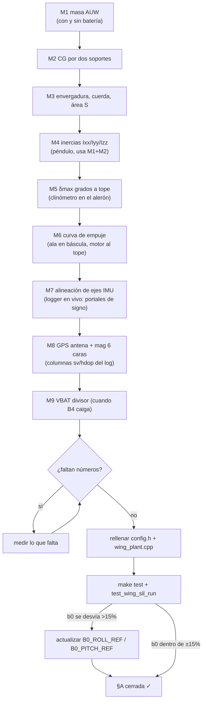
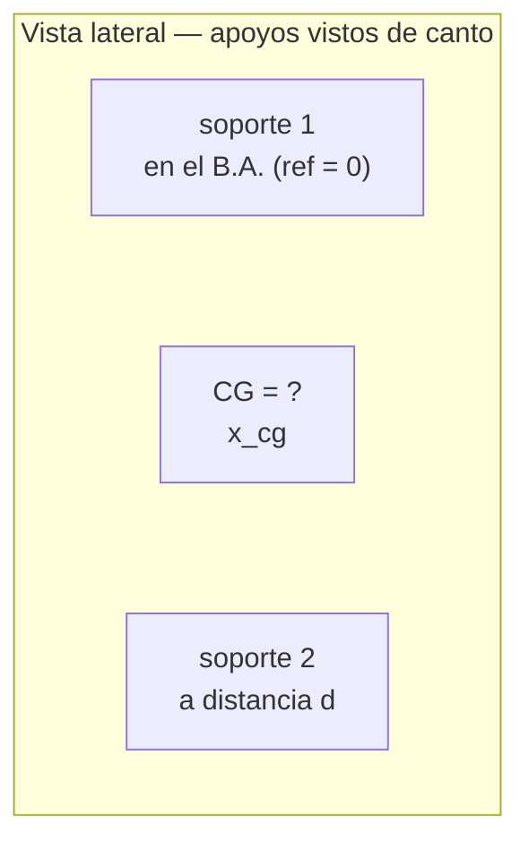
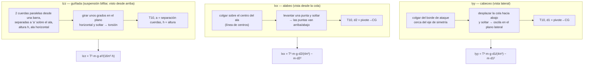
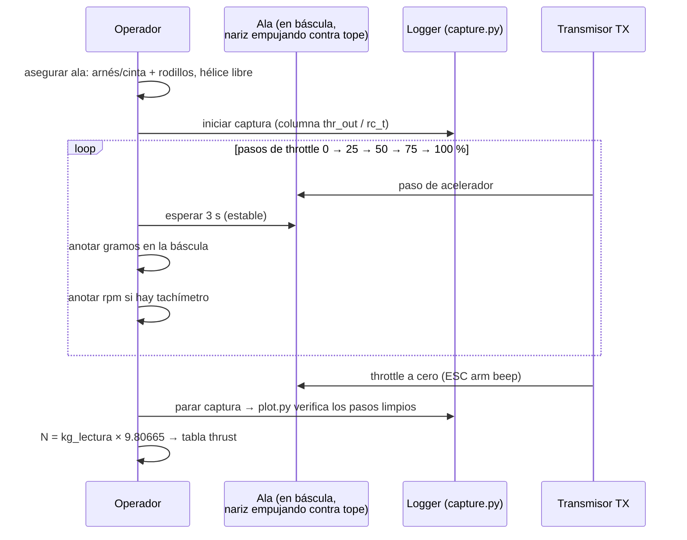
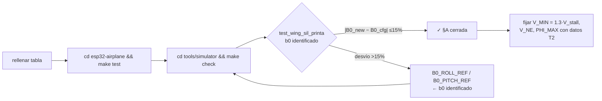

# Hoja de medición del ala física — §A (`airframe-measurements`)

> **Para qué sirve**: conseguir TODOS los números físicos que hoy son
> *placeholders* en `firmware/esp32_airplane/config.h` y en
> `tools/simulator/wing_plant.cpp`, con procedimientos paso a paso y sus
> fórmulas. Rellenar esta hoja cierra la **§A** del `CHECKLIST.md`,
> re-identifica `b0` en el SIL (J1) y habilita las series de stall de la
> campaña **T2** (`docs/test-campaign.md`).
>
> **Cuándo**: cuando el ala exista físicamente, **antes** del primer vuelo
> motorizado. El orden de las mediciones importa (M2 depende de M1, M4 de M2).
>
> **Cómo registrar**: columna "Medido" de cada tabla = valor a mano; al final,
> la tabla resumen indica a qué símbolo C va cada uno. Verificación final:
> `cd tools/simulator && make test_wing_sil_run` (re-identifica `b0` solo).

## Orden de la campaña

## Equipo necesario

| Equipo | Para |
|--------|------|
| Báscula de cocina (1 g) | M1 masa, M6 empuje (leyendo gramos) |
| Cinta métrica (mm) | M3 envergadura/cuerda |
| Cuerda fina + punto de suspensión (cinta adhesiva en el borde) | M2 CG, M4 péndulo |
| Teléfono con app de clinómetro/inclinómetro | M5 ángulos de alerón, M7 signos |
| Cinta métrica + regla | M4 brazo `d`, separación `a`, altura `h` |
| Cronómetro (o vídeo 240 fps) | M4 periodo `T` (10 oscilaciones) |
| Multímetro | M9 divisor de batería |
| PC con `tools/wing_logger/capture.py` + `plot.py` | M5, M6, M7 (logger en vivo) |

---

## M1 — Masa (AUW) → `MASS_KG` / `WingParams.mass`

**Procedimiento**
1. Báscula a cero con el ala montada como volará: batería **cargada**, tornillos,
   GPS, ESP32, receptores, cámara todo puesto.
2. Pesar 3 veces, promediar. Registrar también **sin batería** (transporte).

| Configuración | Medido (kg) |
|---|---|
| AUW vuelo (batería puesta) → `MASS_KG` | ______ |
| Sin batería | ______ |
| Masa batería (diferencia) | ______ |

- **Destino**: `MASS_KG` (`config.h`, hoy `0.80f`) y `WingParams.mass` (`wing_plant.cpp`).
- **Nota**: la tasa de empuje-a-peso real = `thrust_max / (mass·9.81)`;
  con `thrust_max = 14 N` y 0.80 kg son 1.79 — reevaluar tras M6.

## M2 — Centro de gravedad → `Cm0` (colocación del CG)

Método de **dos soportes con báscula** (o balance de canto si no hay dos
básculas): el ala se apoya en dos filos paralelos, uno en la referencia de
cuerda (borde de ataque) y otro a distancia `d` detrás.

1. Apoyar soporte 1 exactamente en el borde de ataque; soporte 2 a `d =`
   ______ m por detrás.
2. Leer cargas `W1` (soporte 1) y `W2` (soporte 2) en gramos.
3. Balance de momentos sobre soporte 1:

$$x_{cg} = d \cdot \frac{W_2}{W_1 + W_2}$$

4. Repetir con el ala **del revés** (soporte 1 en el borde de fuga) como
   verificación: ambos resultados deben dar el mismo CG.

| Dato | Medido |
|---|---|
| `d` (m) | ______ |
| `W1` / `W2` (g) | ______ / ______ |
| `x_cg` desde B.A. (m) | ______ |
| `x_cg` en % de cuerda (→ **% CG**) | ______ |

- **Destino**: en ala voladora el CG se modela vía `Cm0 = −Cmα·α_trim(V_CRUISE)`
  en `wing_plant.cpp` — con el CG real dentro del rango típico **25–40 %c**
  el comentario del placeholder sigue siendo válido; si el CG queda fuera,
  cambiar `alpha_trim` para que el trim de crucero ocurra en el CG medido.
- **Sanidad**: si `x_cg < 20 %c` o `> 55 %c`, parar — el diseño es volable?

## M3 — Envergadura, cuerda, área `S` → `WingParams.b/.S`

1. Envergadura `b` = punta a punta (mm).
2. Cuerdas: medir `c_RA` en la raíz y `c_TP` en punta.
3. Área por trapecios: partir el ala en 4–6 estaciones, medir cuerda `c_i`,
   separación `Δb_i`:

$$S = \sum_i \frac{c_i + c_{i+1}}{2} \cdot \Delta b_i \qquad AR = \frac{b^2}{S}$$

| Dato | Medido | Placeholder hoy |
|---|---|---|
| `b` (m) | ______ | 1.10 |
| `c_RA` / `c_TP` (m) | ______ / ______ | — |
| `S` (m²) | ______ | 0.30 |
| `AR` (derivado) | ______ | 4.03 |

- **Destino**: `WingParams.b`, `WingParams.S`. `S` además entra en `MASS`/`b0`
  (`b0 = q̄·S·b·Cl_δ·δmax / Ixx`).

## M4 — Inercias `Ixx / Iyy / Izz` → `WingParams.Ixx/.Iyy/.Izz`

**Fórmula (péndulo físico)** — con el ala colgada de un punto de suspensión
a distancia `d` del CG, el periodo de oscilación `T` (medir **10
oscilaciones** y dividir) da la inercia **sobre el pivote**; se resta el
término paralelo:

$$I_{cg} = \frac{T^2 \, m \, g \, d}{4 \pi^2} - m \, d^2$$

**Pasos comunes**
1. Marcar el CG (M2) antes de colgar — `d` se mide **pivote → CG** con regla.
2. Desplazar poco (< 15°) para que la oscilación sea armónica.
3. Cronometrar 10 oscilaciones × 3 repeticiones → `T = t/10`.

| Inercia | `T` 10 osc. (s) | `d`/`a`/`h` (m) | Medido (kg·m²) | Placeholder hoy |
|---|---|---|---|---|
| `Ixx` (alabeo) | ______ | d = ______ | ______ | 0.025 |
| `Iyy` (cabeceo) | ______ | d = ______ | ______ | 0.030 |
| `Izz` (guiñada) | ______ | a = ______, h = ______ | ______ | 0.045 |

- **Sanidad**: para un ala de ~0.8 kg y envergadura `b`, una tira plana
  daba `m·b²/12 ≈ 0.08` — lo medido debe ser del mismo orden (×0.2 a ×1.5).
  Un valor 10× menor ⇒ error de unidad o de `d`.
- **Destino**: `WingParams.Ixx/.Iyy/.Izz` — `b0` es inverso a `Ixx/Iyy`
  (identificado en SIL: roll 87.3 / pitch 75.2 @ 15 m/s con placeholders).

## M5 — Grados de alerón a tope `δmax` → `WingParams.delta_max`

1. Poner el ala en nivel (app clinómetro sobre el alerón, ala apoyada y
   descargada).
2. Clinómetro a **cero** con mando al centro; tirar/pulsar mando a tope
   (con pasadores/seguros y **sin motor**) → leer grados de cada superficie,
   en subida y en bajada. Repetir con mando de alabeo a tope.
3. Registrar máximos de cada eje en cada dirección.

| Superficie | Subida (°) | Bajada (°) | `δmax` = máx | °/µs |
|---|---|---|---|---|
| Izq. pitch | ____ | ____ | ____ | ______ |
| Der. pitch | ____ | ____ | ____ | ______ |
| Izq. roll | ____ | ____ | ____ | ______ |
| Der. roll | ____ | ____ | ____ | ______ |

- **Destino**: `WingParams.delta_max` (hoy `0.40 rad` = 23°) = el **mayor**
  de los valores medidos, en rad (`° × π/180`).
- La columna °/µs valida `ELEVON_PITCH_MAX_US`/`ELEVON_ROLL_MAX_US` (hoy
  600/500 µs): `span_us × (°/µs)` debe dar el ángulo medido (±10 %).
- **B3**: si el servo zumba a tope, reducir `span_us` en el portal 20 µs.

## M6 — Curva de empuje `thrust(throttle)` → `WingParams.thrust_max`

**Seguridad**: nunca con el ala suelta; la báscula **empujando** (nariz contra
la báscula sobre un tope), o el ala amarrada con la báscula debajo del motor
en compresión. Hélice despejada de cables y manos. Ventilación para el ESC.

| Throttle % (`rc_t`) | Lectura (g) | Empuje (N) |
|---|---|---|
| 0 (arm) | ______ | ______ |
| 25 | ______ | ______ |
| 50 | ______ | ______ |
| 75 | ______ | ______ |
| 100 | ______ | ______ |

- **Destino**: la columna Empuje a `rc_t = 1.0` → `WingParams.thrust_max`
  (hoy `14 N`). Si el ESC/motor no llega al tope lineal, añadir la curva
  completa a `wing_plant.cpp` (`T(δ)` lineal por ahora).
- El logger valida que los pasos fueron limpios (panel 4 de `plot.py`:
  `thr_out` escalones sin caídas de `gps_v`… en tierra `gps_v≈0`; ver
  `rc_t` vs `thr_out` en panel 1/2).

## M7 — Alineación de ejes de la IMU → `drivers/imu_*.cpp`

Objetivo: que al **mover el ala en VUELO** los signos del log sean los de la
convención del controlador: **pitch+ = nariz arriba, roll+ = ala derecha
abajo, yaw+ = a la derecha**.

**Procedimiento (logger en vivo, sin despegar)**
1. `capture.py --port …` (o `--udp`), ala sobre la mesa, portal → passthrough.
2. Mover la ala y mirar columnas `ax,ay,az / roll,pitch,yaw` (paneles 3 y 5):

| Maniobra en la mesa | Esperado en el log | Si no coincide |
|---|---|---|
| Nariz arriba | `pitch` crece (+), `az` → +1 g al nivelar | invertir/remapear ejes en el driver de la IMU |
| Ala derecha baja | `roll` crece (+) | idem |
| Nariz a la derecha | `yaw` crece (+) | idem (magnetómetro) |
| Empujar el ala al frente (acelerar) | `ax` → +1 g | eje X mal mapeado |

- **Destino**: rotación de ejes en `drivers/imu_gy91.cpp` / `imu_gy87.cpp`
  (hoy sin rotación: se asume el módulo montado con sus flechas alineadas
  al fuselaje). Regla: **montar el módulo con las flechas del PCB hacia
  delante/arriba** y solo software si no hay forma mecánica.

## M8 — Antena GPS + calibración mag → `GPS_*` / mag cal

1. **Antena GPS**: sobre lo más alto y despejado, **> 5 cm** de ESC/batería;
   probar 2–3 posiciones mirando columnas `sv` y `hdop` en exterior (meta:
   `sv ≥ 8`, `hdop ≤ 1.5` estando en tierra). Registrar la posición ganadora.
2. **Magnetómetro (6 caras)**: girar el ala en las 6 orientaciones de caja
   con motor **apagado** → guardar offsets duros (cuando el calibrador
   exista, H4/C8 — procedimiento: rotaciones lentas en los 3 ejes, 30 s).
3. **Interferencia con motor en marcha**: repetir la lectura `mag` con motor
   al ralentí y al 50 %: si el campo se desvía > 15 µT, alejar el módulo o
   añadir offsets blandos por amperaje (anotar la desviación aquí).

| Posición antena | `sv` | `hdop` | ¿Ganadora? |
|---|---|---|---|
| ___ | ___ | ___ | ☐ |
| ___ | ___ | ___ | ☐ |

## M9 — Divisor de batería (cuando caiga B4/H3)

1. Multímetro en paralelo con la batería (V real) mientras el log corre.
2. Cuando exista la columna de ADC (hoy `VBAT` es placeholder en `config.h`),
   calibrar `V = ADC_raw · k + b` con 2–3 puntos (batería cargada / media /
   baja). Registrar `k`, `b` en `config.h`.

---

## Resumen: símbolos y estado

| # | Símbolo | Archivo destino | Placeholder hoy | Medido | ☑ |
|---|---|---|---|---|---|
| M1 | `MASS_KG` / `mass` | `config.h` / `wing_plant.cpp` | 0.80 kg | ______ | ☐ |
| M2 | % CG → `alpha_trim` | `wing_plant.cpp` (Cm0) | CG ~30 %c | ______ | ☐ |
| M3 | `b`, `S` | `wing_plant.cpp` | 1.10 m, 0.30 m² | ______ | ☐ |
| M4 | `Ixx/Iyy/Izz` | `wing_plant.cpp` | .025/.030/.045 | ______ | ☐ |
| M5 | `delta_max` | `wing_plant.cpp` | 0.40 rad (23°) | ______ | ☐ |
| M6 | `thrust_max` | `wing_plant.cpp` | 14 N | ______ | ☐ |
| M7 | rotación de ejes | `drivers/imu_gy*.cpp` | sin rotación | ______ | ☐ |
| M8 | antena + mag | montaje + cal | — | ______ | ☐ |
| M9 | divisor VBAT `k,b` | `config.h` (B4) | placeholder | ______ | ☐ |
| A6 | `V_stall`, `V_ne` | `config.h` | 9 / 30 m/s | **vía T2** | ☐ |

> `V_stall` NO se mide aquí: se obtiene volando la campaña **T2** de
> `docs/test-campaign.md` (hoy `V_MIN_MPS = 1.3 × 9 = 11.7` es el placeholder).

## Verificación tras rellenar

1. `cd esp32-airplane/firmware && make test` (279) — el esquema de settings
   y logger no debe romperse.
2. `cd tools/simulator && make check` — el SIL usa los números nuevos; si
   `b0` identificado se desvía >15 % de `B0_*_REF`, **actualizar el config**
   (el test falla si no).
3. Rellenar la columna Medido de arriba y marcar los ☑ en el `CHECKLIST.md` §A.
