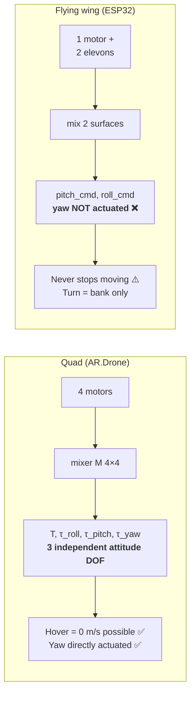
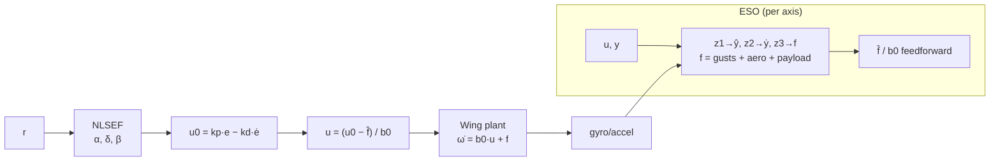
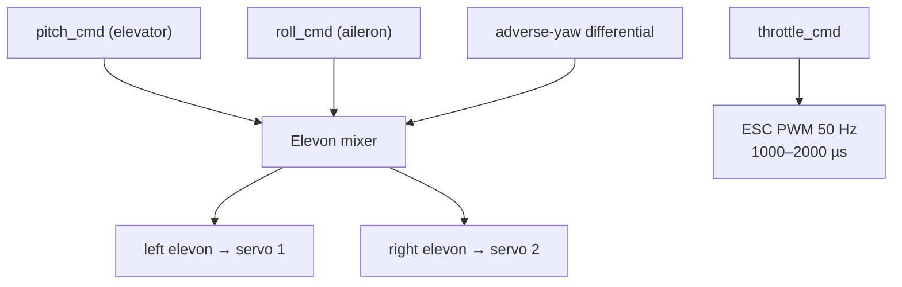
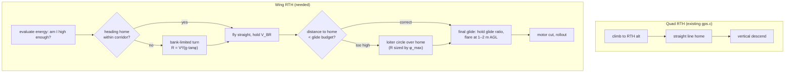
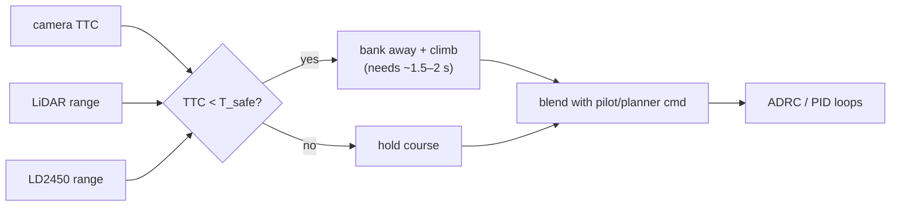
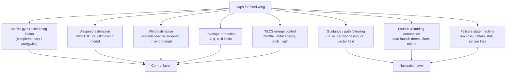
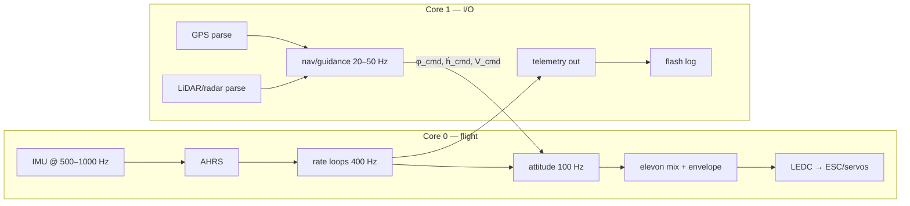
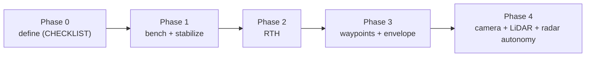

# Algorithm Mapping: AR.Drone 2.0 → ESP32 Flying Wing

> Decision document: which of the algorithms already studied and implemented
> for the AR.Drone (quadcopter, TI OMAP3530, 600 MHz) can be reused — and how
> they must change — on a **flying wing** flown by an **ESP32**.
>
> Companion documents: [`../CHECKLIST.md`](../CHECKLIST.md) (iterative
> definition checklist) and `../../docs/auto-recovery-navigation.md`
> (research sources).

---

## 0. Locked baseline (decided)

| # | Decision | Value |
|---|----------|-------|
| 1 | Airframe | **Ala voladora (flying wing)** — elevons only, no rudder, no separate elevator |
| 2 | Sensors | **IMU + baro + GPS + magnetometer + LiDAR (TFmini) / radar (HLK-LD2450)** |
| 3 | Autonomy (phase 1) | **Stabilization + RTH**; phase 2 adds camera + LiDAR + radar for autonomous flight |
| 4 | Propulsion | **Electric + ESC (throttle PWM)** |

---

## 1. The fundamental difference: 3-axis quad vs 2-surface wing

This single fact drives every adaptation below.



| Aspect | Quad (AR.Drone) | Flying wing (ESP32) |
|--------|-----------------|---------------------|
| Control inputs | 4 × motor thrust | 2 × elevon + 1 × throttle |
| Attitude DOF | 3 independent (roll/pitch/yaw) | **2 direct** (roll/pitch); yaw underactuated |
| Turning | yaw or bank | **bank only** (coordinated turn) |
| Hover / stop | ✅ yes | ❌ never — always needs airspeed |
| Stall | ❌ concept doesn't apply | ⚠️ **V must stay > V_stall or crash** |
| Stopping throttle | hovers / lands | **glide or stall+crash** |
| Energy | throttle ↔ altitude directly | throttle ↔ *airspeed*, pitch ↔ altitude |
| Failure of prop | ETH spinning-flight recovery | **deadstick glide** (different algorithm) |
| Min turn radius | ~0 | `R = V² / (g·tan φ)` — matters for RTH |
| Yaw/sideslip control | direct | none — needs elevon differential / winglets |

**Consequence**: roughly 60 % of the AR.Drone stack transfers with little
change (estimation, GPS, geofence, obstacle *inputs*, control *primitives*),
the control + guidance layer needs a genuine rewrite, and a handful of
quad-specific algorithms (spinning recovery, hover-specific flow tuning) are
simply replaced by fixed-wing equivalents.

---

## 2. Verdict summary

Legend: 🟢 reuse as-is · 🟡 reuse after adaptation · 🔴 not applicable → replace

### 2.1 Reuse 🟢

| Algorithm | Source file | Notes |
|-----------|-------------|-------|
| ADRC (ESO + NLSEF) | `src/flight/adrc.c` | See §3.1 — best-fit algorithm for a wing in wind |
| PID cascade primitive | `src/flight/flight_controller.c` | Loop structure reusable; setpoints/mixing change |
| NMEA GPS parser | `src/navigation/gps.c` | Byte-level parser transfers **1:1** |
| Haversine distance/bearing | `src/navigation/gps.c` | Transfers 1:1 |
| Geofence | `src/flight/flight_controller.c` | Radius + altitude (+ polygon) transfers |
| HLK-LD2450 driver/parser | (planned, `docs/auto-recovery-navigation.md` §9) | Frame parser transfers; *usage* changes (§4.4) |
| Laplacian consensus math | `docs/auto-recovery-navigation.md` §7 | Position-domain, airframe-agnostic (phase 3) |
| Line/Hough detection | `src/vision/line_detect.c` | Becomes **runway/road detection** for landing |
| Obstacle detectors (loom/asym/VT) | `src/vision/obstacle.c` | Features reusable; *response* changes (§4.3) |
| Anti-windup via `z3` clamp | `src/flight/adrc.c` | Transfers with the ADRC controller |
| Test harness style | `tools/simulator/test_*.c` | Port to ESP32 host-side unit tests |

### 2.2 Adapt 🟡

| Algorithm | Source | Required adaptation |
|-----------|--------|---------------------|
| ADRC plant gain `b0` | `adrc.c` | **Schedule with dynamic pressure**: `b0 ∝ q ∝ V²` (elevon authority comes from airflow) |
| Outer attitude loop | `flight_controller.c` | Desired bank → desired roll rate; desired pitch → desired pitch rate; add **airspeed loop for throttle** |
| RTH logic | `navigation/gps.c` | Add **turn-radius-limited approach**, loiter-at-home, glide-slope descent (§4.2) |
| Optical flow (SAD) | `flow_stage1.c` | Retune block size/step for **large radial flow** of forward flight → becomes ground-speed estimate |
| Obstacle response | `obstacle.c` | Wing cannot brake ⇒ respond with **bank-away + climb**, earlier TTC threshold |
| Magnetometer fusion | (navdata attitude) | New **AHRS complementary/Madgwick** fusing gyro+accel+mag (was handed by AR.Drone firmware) |
| Wind estimation | (none) | **New**: GPS groundspeed vs airspeed → wind triangle, feeds RTH + energy + b0 scheduling |
| Control mixer | (motor mix) | Replace 4-motor mix with **elevon mix + differential** (§3.2) |

### 2.3 Not applicable → replace 🔴

| AR.Drone algorithm | Why it doesn't apply | Fixed-wing replacement |
|--------------------|----------------------|------------------------|
| ETH **spinning-flight** prop-loss recovery | Single-prop wing doesn't spin; it glides | **Deadstick glide**: hold best-glide `V_BR`, steer with elevons toward field |
| Quad **hover / position hold at 0 m/s** | Wing must keep moving | **Loiter circle** at fixed radius/altitude |
| Quad **vertical climb/descend** as altitude control | Altitude via energy, not direct thrust | **TECS** (total-energy control): throttle↔energy, pitch↔altitude/airspeed split |
| Visual odometry FAST+LK+8pt | Too heavy for ESP32; forward motion ⇒ blur + large-parallax scale problem | **GPS + INS fusion** (baro + mag), defer VO to phase 3 on a companion cam |
| Skyproxy / ARSDK3 Bebop bridge | Different vehicle/protocol | New MAVLink-ish telemetry (§5) |
| Quad stall / rate-test `test_quad_adrc` targets | Dynamics differ | New wing plant model + SIL sim |

---

## 3. The two algorithms that carry over strongest

### 3.1 ADRC — why it is the *right* controller for a wing

A flying wing in outdoor flight is dominated by **wind gusts and turbulence** —
exactly the "total disturbance" ADRC's ESO estimates and rejects without
needing a model. Our implementation (`src/flight/adrc.c`) already has
bandwidth parameterization and `z3` anti-windup.



**Critical adaptation — schedule `b0` with airspeed:**

```
b0_roll(V)  = b0_ref  · ( q / q_ref )   ,  q = ½·ρ·V²
b0_pitch(V) = b0_ref  · ( q / q_ref )
clamp:  b0 ∈ [0.25 · b0_ref , 2.0 · b0_ref]
```

Elevon authority comes from airflow over the surface, so at `V = 0.7·V_ref`
the control effectiveness is roughly `0.49×`. Without scheduling, gains tuned
at cruise are far too weak on approach and dangerously strong in a dive.

**Recommended starting bandwidths (wing, to be validated in SIL):**

| Loop | Plant | `wc` (rad/s) | `wo` (rad/s) | Notes |
|------|-------|--------------|--------------|-------|
| Roll rate | `ω̇_x = b0·δ_a` | 10 – 14 | 3–4 × `wc` | inner, fastest |
| Pitch rate | `ω̇_y = b0·δ_e` | 8 – 12 | 3–4 × `wc` | inner |
| Roll attitude | bank angle | 2 – 3 | — | outer, sets roll-rate cmd |
| Pitch attitude | pitch angle | 1.5 – 2.5 | — | outer, sets pitch-rate cmd |
| Throttle / airspeed | `V̇ = (T−D)/m` | **0.4 – 0.8** | 2–3 × `wc` | very slow; never aggressive |
| Altitude (pitch) | `ḣ = V·sinγ` | 0.5 – 1.0 | — | coupled to airspeed (TECS) |

> Rule of thumb carried from the quad work: `wo ≈ 3–5 × wc`, critical damping
> `kp = wc²`, `kd = 2·wc`. For the wing, keep `wo` conservative — sensor noise
> on a vibrating airframe is higher than on a damped quad.

### 3.2 Elevon mixing (replaces the 4-motor mixer)

```c
/* sign conventions MUST be validated on the bench — see CHECKLIST A3 */
left_elevon  = pitch_cmd - roll_cmd;
right_elevon = pitch_cmd + roll_cmd;
/* differential to fight adverse yaw (no rudder available): */
left_elevon  -= diff * fabsf(roll_cmd) * sign(roll_cmd);
right_elevon += diff * fabsf(roll_cmd) * sign(roll_cmd);
clamp both to [servo_min, servo_max];
```



---

## 4. Adaptations in detail

### 4.1 Turning & envelope (new, mandatory)

Without a rudder, yaw is created **only by banking**:

```
turn rate   ψ̇ = g·tan(φ) / V
turn radius R  = V² / (g·tan(φ))
```

Examples (g = 9.81): V = 15 m/s at φ = 30° → **R ≈ 39 m**; at φ = 45° → R ≈ 23 m.
This directly sizes the RTH loiter and the geofence.

Envelope protection (must live in the control layer, not the pilot):

| Limit | Symbol | Typical foam wing | Action on violation |
|-------|--------|-------------------|---------------------|
| Min airspeed | `V_min = 1.3·V_stall` | 10 → 13 m/s | pitch down / reduce bank, throttle max |
| Max airspeed | `V_ne` | 30 – 35 m/s | throttle idle + spoilers/dive check |
| Max bank | `φ_max` | 45 – 60° | clamp roll command |
| Load factor | `n_max` | +3 / −1.5 g | clamp bank & pitch pull |
| Max climb/sink | `ḣ_max` | ±6 m/s | pitch clamp |

### 4.2 RTH — quad logic vs wing logic



The **Haversine parser + distance/bearing functions transfer unchanged**; only
the sequencing/planning layer is new.

### 4.3 Obstacle response

`obstacle.c` gives looming / asymmetry / time-to-collision. A wing **cannot
brake**, so:



Threshold must be **earlier than on a quad** — a bank maneuver takes real time.

### 4.4 HLK-LD2450 usage on a wing (honest caveat)

Range is **6 m**. At cruise `V ≈ 15 m/s`, 6 m = **0.4 s** — useless as a cruise
avoidance sensor. It *is* valuable for:

| Use | Mount | Value |
|-----|-------|-------|
| Terrain / ground proximity | downward | only < 6 m ⇒ **landing & flare assist**, low-altitude alt |
| Final-approach obstacle check | forward | last-resort during landing |
| Person / drone detection near pad | forward/side | 3 targets, works in dark/dust/smoke |
| Low-speed / loiter hazard | forward | when `V` is low and time-to-act is longer |

Cruise obstacle avoidance needs the **TFmini (12 m)** at minimum and ideally
vision. This is a key reason phase 2 adds the camera.

---

## 5. New algorithms required (not present in the AR.Drone code)



| # | Algorithm | Why needed | Priority |
|---|-----------|-----------|----------|
| N1 | **AHRS** (mag fusion) | AR.Drone firmware gave attitude free; ESP32 must compute it | **P0** |
| N2 | **Airspeed estimation** | Every envelope & b0 scheduling rule depends on `V` | **P0** (start GPS-derived) |
| N3 | **Wind estimation** | RTH, energy budget, `b0` accuracy | P1 |
| N4 | **Envelope protection** | Prevents stall/spin — the #1 killer of wings | **P0** |
| N5 | **L1 / carrot guidance** | Turns waypoints + RTH into smooth bank commands | **P0** (for RTH) |
| N6 | **TECS** | Correct throttle/pitch decoupling for a wing | P1 |
| N7 | **Auto-launch / flare** | Phase 1 manual launch OK; flare needed for RTH landing | P1 |
| N8 | **Failsafe FSM** | Link loss → RTH; low battery → land; sensor loss → degrade | **P0** |

### L1 guidance (sketch — the one to implement first)

```
/* command bank angle from cross-track error to the path */
L1     = 2 · R_turn            /* lookahead distance          */
η      = atan2( e_lat , L1 )   /* lateral lookahead angle     */
u_s    = 2 · sin(η) · V² / L1  /* lateral acceleration        */
φ_cmd  = atan( u_s / g )       /* bank command                */
clamp φ_cmd to [−φ_max, +φ_max]
```

Feeds directly into the bank-attitude ADRC/PID loop. Also drives waypoint
sequencing and the RTH loiter.

---

## 6. ESP32 constraints that shape the algorithm choice

| Constraint | Impact on algorithm choice |
|------------|----------------------------|
| **Single-precision FPU only** — `double` is soft-float and slow | Use `float` everywhere; no `double` trig in the control loop; precompute tables |
| 240 MHz, dual-core Xtensa LX6 | Rate loops (400 Hz) on one core, telemetry/GPS/logging on the other via FreeRTOS |
| ~520 KB SRAM, 4 MB flash | No image pipeline in RAM ⇒ **defer camera vision**; log to flash ring buffer |
| LEDC PWM (16 ch, up to 16-bit) | 50 Hz ESC/servo, 1000–2000 µs ⇒ 16-bit gives ~0.3 µs resolution (plenty) |
| 3 × UART | UART0 = debug/USB, UART1 = GPS, UART2 = LiDAR **or** radar (check board!) |
| I2C + SPI | SPI for IMU (1 kHz), I2C for baro + mag |
| ADC (12-bit) | Battery via divider + optional current sensor; Pitot via差分/amp if used |
| WiFi/BT range (~50 m) | **Not** a flight-control link — use ELRS/900 MHz RC + ESP32 for telemetry/logging |
| No RTOS by default in Arduino | Bring up **FreeRTOS tasks** explicitly; add task watchdog |



---

## 7. Recommended stack by phase



| Phase | Algorithms used | Source |
|-------|-----------------|--------|
| **1 — Stabilize** | AHRS (N1), elevon mix, ADRC/PID roll+pitch rate + attitude, envelope (N4 basic), failsafe FSM (N8 basic) | `adrc.c`, `flight_controller.c` + new N1/N4 |
| **2 — RTH** | + airspeed est (N2), L1 guidance (N5), wind est (N3), wing-RTH sequencing, geofence | `gps.c` + new N5 + rewritten RTH |
| **3 — Waypoints** | + TECS (N6), auto-launch/flare (N7), obstacle response, flow-based groundspeed | `obstacle.c`, `flow_stage1.c` + N6/N7 |
| **4 — Full autonomy** | + camera (line/runway, VO defer), TFmini terrain, LD2450, later consensus | `line_detect.c`, `obstacle.c`, `docs/auto-recovery-navigation.md` |

---

## 8. Bottom line

- **Reuse confidently**: ADRC (the star — with `b0 ∝ q` scheduling), PID loop
  structure, GPS parser/Haversine, geofence, obstacle *feature extraction*,
  line/Hough detection, LD2450 frame parser, consensus math.
- **Rewrite**: RTH sequencing, mixer (elevons), outer-loop setpoints,
  obstacle *response*, optical-flow tuning.
- **Build new**: AHRS, airspeed/wind estimation, envelope protection, L1
  guidance, TECS, launch/landing, failsafe FSM.
- **Drop**: ETH spinning-flight recovery (→ deadstick glide), quad
  hover/vertical-altitude logic, on-board visual odometry.

**The single biggest risk is not the control law — it is stall.** Every phase
must ship envelope protection before anything autonomous moves a control
surface. This is tracked as item **N4 / C4** in
[`../CHECKLIST.md`](../CHECKLIST.md).

---

## References

- `docs/auto-recovery-navigation.md` — motor-fail recovery, consensus, LD2450 research
- `src/flight/adrc.c` — ADRC implementation (ESO + NLSEF, bandwidth tuning)
- `src/flight/flight_controller.c` — PID cascade, modes, geofence
- `src/navigation/gps.c` — NMEA parser, Haversine, RTH
- `src/vision/{obstacle,line_detect,flow_stage1,visual_odometry}.c`
- `tools/simulator/` — quad SIL (template for a wing SIL)
