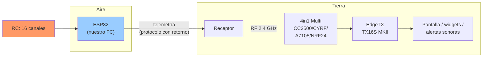
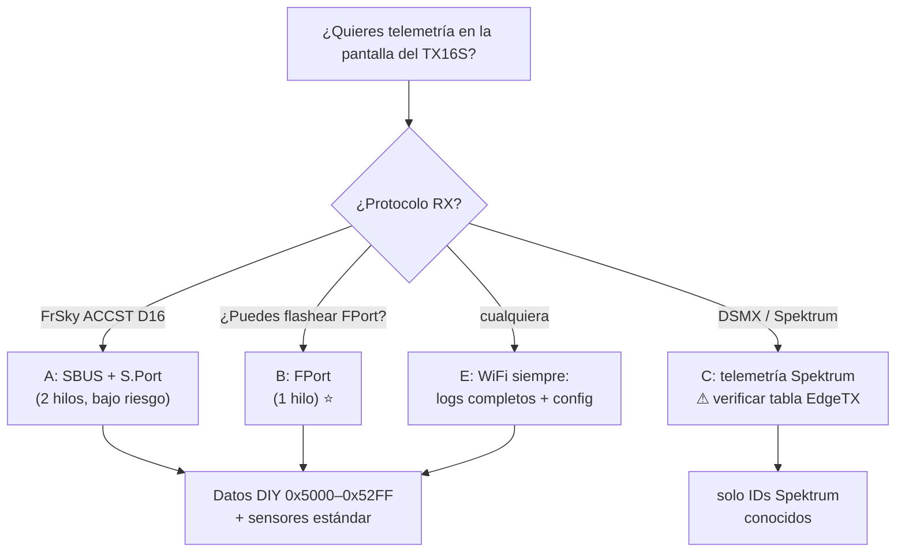
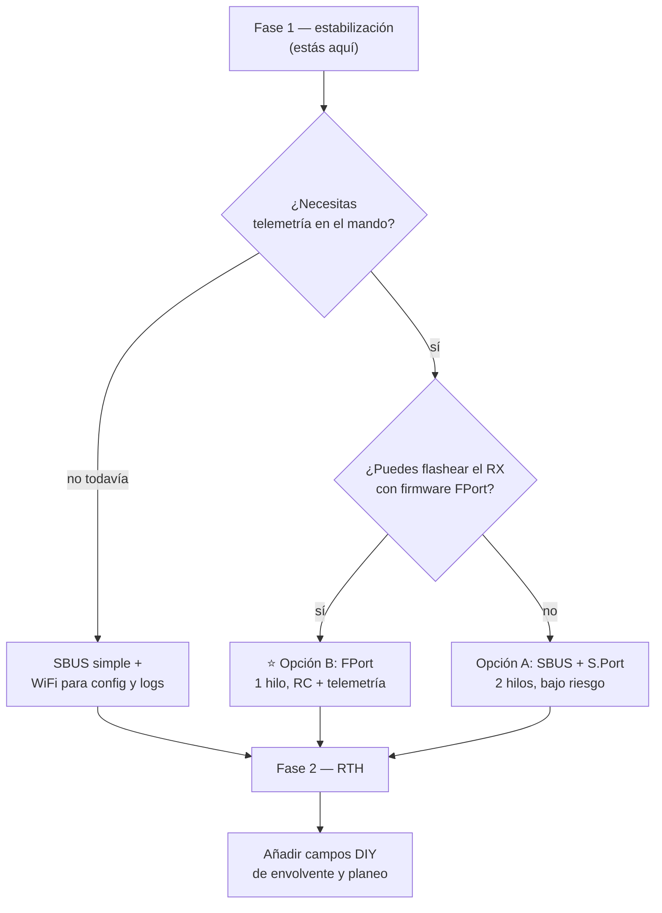

# RC Input & Telemetry to the TX16S MKII — feasibility

> Question: *can we send telemetry back to the Radiomaster TX16S MKII
> (internal 4-in-1 multi-protocol module, EdgeTX) over SBUS/Spektrum, and if
> so, what data?*
>
> Companion: [`../CHECKLIST.md`](../CHECKLIST.md) §B.2 / §C / §I.

---

## 1. Direct answer

| Question | Answer |
|----------|--------|
| ¿SBUS puede llevar telemetría? | **NO.** SBUS es estrictamente unidireccional (RX → FC). |
| ¿Se puede mandar telemetría al TX16S MKII? | **SÍ**, pero **no por SBUS** — hay que elegir un protocolo con retorno. |
| ¿El módulo 4in1 la reenvía a EdgeTX? | **SÍ.** El Multi manda a EdgeTX: `type 0x02` (FrSky S.Port), `0x03` (FrSky Hub), `0x04` (Spektrum), `0x06` (FlySky AFHDS2A). |
| ¿Datos propios (nuestros)? | **SÍ con FrSky** (IDs DIY `0x5000–0x52FF`). Parcialmente con Spektrum. No con FlySky. |



---

## 2. ¿Por qué SBUS no sirve para telemetría?

| Propiedad | SBUS |
|-----------|------|
| Dirección | **1 vía**: receptor → control de vuelo |
| Baud | 100 000 |
| Formato | 8E2, **invertido**, trama de 25 B, 16 canales + flags |
| Pin usado | solo **RX** del UART del FC |
| Retorno | **no existe** — no hay byte, tiempo ni nivel para ello |

Fuentes: protocolo Futaba S.Bus; FrSky añadió después **S.Port** como
protocolo *separado* precisamente porque SBUS no tenía retorno.

> **Conclusión**: si queremos telemetría, el cableado/protocolo del receptor
> cambia. SBUS solo sigue siendo válido para la **fase 1 de estabilización**
> (mando → avión, sin vuelta).

---

## 3. Opciones de protocolo (todas validadas contra el 4in1 + EdgeTX)

| # | Opción | Cables al FC | Receptor necesario | ¿4in1 lo reenvía? | Datos propios | Riesgo |
|---|--------|--------------|--------------------|--------------------|---------------|--------|
| **A** | **SBUS + S.Port** | 2 (RX + TX) | FrSky ACCST D16: **X8R, X4R-SB, R-XSR, XSR** | ✅ `type 0x02` | ✅ DIY | Bajo |
| **B** | **FPort** ⭐ | **1** (semidúplex) | FrSky **flasheado con firmware FPort** | ✅ (S.Port embebido) | ✅ DIY | Medio |
| **C** | **DSMX + Spektrum telem** | 1 | RX Spektrum **con telemetría**: AR637T, Lemon-RX G2 | ✅ `type 0x04` | ⚠️ ver §5 | Medio-alto |
| **D** | FlySky AFHDS2A | 1 | iA6B / iA10B | ✅ `type 0x06` | ❌ | Bajo |
| **E** | **SBUS + WiFi** (paralelo) | 1 | cualquiera | — (no va al mando) | ✅ libre | Bajo |

### 3.1 Opción A — SBUS + S.Port (2 hilos, recomendada para empezar)

```
RX: SBUS  ──────────────►  ESP32 UART2 RX     (canales, 100000 8E2 inv.)
RX: S.Port ─┬────────────►  ESP32 UART1 TX     (telemetría, 57600, semidúplex)
            └─ diodo 1N4148 (dirigido al FC) ──┘
```

- SBUS aporta los 16 canales; S.Port aporta **solo salida** (FC → RX).
- S.Port es **semidúplex en un solo hilo e invertido**: se une TX y RX con un
  diodo (o resistor de unas pocas decenas de kΩ) — truco estándar ya probado
  con Betaflight/OpenTX.
- El RX reenvía la telemetría por RF → 4in1 → EdgeTX.

### 3.2 Opción B — FPort (1 solo cable) ⭐ *si podemos flashear el RX*

```
RX: SmartPort/pad FPort ──┬──► ESP32 UART (TX+RX unidos vía diodo 1N4148)
                          └── 115200 N81, invertido, semidúplex
```

- **Combina SBUS + S.Port en un hilo**: 16 canales + RSSI + telemetría
  (incl. MSP) → ahorra un UART y un cable.
- Ligeramente más rápido que SBUS; RSSI automático (sin consumir canal).
- Requiere RX con firmware FPort (XSR, X4R-SB, R-XSR).

> ⚠️ **Caveat ESP32**: el UART del ESP32 **sí** soporta inversión de línea
> (`uart_set_line_inverse`), pero **no** tiene semidúplex de hardware como un
> STM32. Hay que unir TX y RX con un diodo. Validar en banco antes de volar.

### 3.3 Opción C — DSMX + Spektrum (si insistimos en "Spektrum")

- El Multi 4in1 sí decodifica y reenvía telemetría Spektrum (`type 0x04`:
  `data[0]=RSSI`, `data[1..15]` = 15 bytes de trama Spektrum).
- La spec de Spektrum **sí define 4 structs de usuario**
  (`STRU_TELE_USER_16SU`, `USER_16SU32U`, `USER_16SU32S`, `USER_16U32SU`)
  pensados para terceros.
- **PERO**: la tabla `spektrumSensors[]` de `radio/src/telemetry/spektrum.cpp`
  en EdgeTX **no incluye los IDs de esos 4 dispositivos USER** (ver
  EdgeTX issue #3368: *"many Spektrum telemetry sensors not defined"*).
  → **Muy probable que EdgeTX descarte nuestra telemetría user-defined.**

**Recomendación**: verificar en tu versión de EdgeTX buscando `USER` en
`spektrumSensors[]` antes de apostar por esta vía. Si no está, DSMX nos deja
solo con telemetría de sensores Spektrum *ya conocidos* (QoS fades, A1/A2,
vario, GPS, ESC), **no con nuestros campos propios**.

### 3.4 Opción E — WiFi (siempre, en paralelo)

El portal de configuración WiFi que implementamos (§7) puede publicar
telemetría **sin restricción de ancho de banda** a un móvil/portátil. Es la
vía para logs completos y depuración; la del mando es para lo esencial en
vuelo.



---

## 4. Elección de protocolo en el TX16S

**Cambio de setup en EdgeTX** (MDL → Modelo → Internal RF):

| Modo interno | Protocolo | Receptor | Telemetría |
|--------------|-----------|----------|------------|
| `MULTI` | **FrSkyX2** (ACCST 2.x) | R-XSR / X4R-SB / X8R | ✅ S.Port / FPort |
| `MULTI` | `DSMX` 2048 | Spektrum-compatible | ✅ (limitada, §3.3) |
| `MULTI` | `FlySky AFHDS2A` | iA6B / iA10B | ✅ (básica) |
| `MULTI` | `SFHSS` | SFHSS | ❌ |

> **Importante**: el 4in1 **no** soporta FrSky **ACCESS** (solo ACCST 1.x/2.x)
> — cuidado al comprar receptor.

---

## 5. ¿Qué telemetría podemos mandar?

S.Port/FPort es **master–slave**: el receptor emite un *poll* cada ~12 ms y el
FC responde **1 trama** = `dataId` (16 b) + `value` (32 b). Round-robin sobre
la tabla de sensores ⇒ **~80 valores/s** en total.

Con ~10–15 campos DIY + ~15 estándar = **25–30 campos ⇒ refresco ≈ 250–300 ms**
— perfecto para HUD, alarmas y widgets.

### 5.1 Sensores estándar (EdgeTX los auto-descubre: *Discover Sensors*)

| Campo | Fuente | ID S.Port (Betaflight `FSSP_DATAID_*`) |
|-------|--------|----------------------------------------|
| Tensión batería | ADC `PIN_VBAT_ADC` | `VFAS 0x0210` |
| Corriente | sensor A (opcional) | `0x0200` |
| Consumo mAh | integrador | `FUEL 0x0600` |
| Altitud | baro BMP180/BMP280 | `ALTITUDE 0x0100` |
| Variómetro | Δalt | `VARIO 0x0110` |
| Velocidad GPS | GPS `GSPD` | `0x0000` |
| Latitud / Longitud | GPS | `GPS 0x0800` (par lat/lon) |
| Satélites | GPS | — |
| Rumbo | GPS course | `HEADING 0x0800` |
| Actitud roll/pitch | AHRS | `PITCH` / `ROLL` |
| Aceleraciones | IMU | `ACCX/Y/Z 0x0700/710/720` |
| RSSI / link | **lo aporta el enlace** (FPort automático) | — |

### 5.2 Campos DIY propios — IDs `0x5000–0x52FF` ⭐

Esto es lo que ningún receptor de serie da y es **nuestro valor añadido**:

| # | Campo DIY | Tipo | Por qué importa |
|---|-----------|------|-----------------|
| 1 | **Fase de vuelo** | uint8 enum | `DISARMED / ARMED / NAV_RTH / LOITER / FINAL_GLIDE / FAILSAFE_GLIDE / LANDED` |
| 2 | **Flags de envolvente** | bitmask | `STALL · BANK_LIMIT · VNE · G_LIMIT` — alarma inmediata al piloto |
| 3 | **V_aero estimada** (m/s) | float→int | Diferente de V_GPS; clave cerca del estallido |
| 4 | **Distancia a home** (m) | uint16 | RTH y geofence |
| 5 | **Bearing a home** (°) | uint16 | Ayuda a orientar el RTH |
| 6 | **Altura sobre home** (m) | uint16 | Presupuesto de planeo |
| 7 | **Margen de planeo** (%) | uint16 | `alcanza_home = f(L/D, Δalt)` |
| 8 | **`f̂` ESO roll** | int16 | Perturbación total estimada (ráfagas) |
| 9 | **`f̂` ESO pitch** | int16 | idem |
| 10 | **`b0` programado** | uint16 | Muestra que la programación `b0∝q` está viva |
| 11 | **Distancia a la valla** (m) | uint16 | Margen de geofence |
| 12 | **Estado preflight** | bitmask | Qué bloquea el armado |
| 13 | **Jitter del loop** (µs) | uint16 | Salud del tiempo real |
| 14 | **Edad GPS / RC** (ds) | uint16 | Detección de enlace degradado |
| 15 | **Modelo IMU** (GY87/GY91) | uint8 | Identificar con qué HW volamos |

### 5.3 Cómo asignarlos en EdgeTX

1. En el modelo: **Telemetry → Delete all sensors**.
2. **Discover new sensors** con el ala encendida y el enlace activo.
3. EdgeTX crea sensores con nombre por defecto → **renombrar** a gusto
   (`Fase`, `Env`, `Vaur`, `DHome`, `f̂R`, …) y poner unidades.
4. Añadir widgets/telemetría screen con esos sensores.
5. Crear **alertas** (logical switches): p.ej. `Env>0` → aviso sonoro;
   `Vaur < 1.3·V_stall` → "STALL".

---

## 6. Ancho de banda y prioridades

```
poll S.Port: 12 ms → ~83 respuestas/s
nuestros campos: 15 DIY + 15 std = 30
→ cada campo se refresca cada 30/83 ≈ 0.36 s
```

Si queremos **≤100 ms** en los críticos (envolvente, V_aero, fase), reducir el
conjunto enviado en vuelo:

```c
/* En vuelo: solo prioritarios. En tierra: todos. */
#define TELEM_FAST_MASK  (ENV_FLAGS | PHASE | VAERO | DIST_HOME)   // ~4 campos
// → refresco ~50 ms para lo crítico, resto en background
```

---

## 7. Decisión recomendada (fase 1)



**Plan concreto:**

1. **Fase 1 (ahora)** — control por **SBUS** (o Spektrum si el RX ya está
   ligado), telemetría completa por **WiFi** al móvil. Sin dependencias de RX.
2. **Decidir RX** — si compramos **FrSky ACCST D16** (R-XSR es el más
   compacto), desbloqueamos A/B y toda la tabla DIY.
3. **Fase 2** — añadir S.Port o FPort y publicar los 15 campos DIY.
4. **Verificar antes de volar**: si vamos por DSMX, comprobar que la
   `spektrumSensors[]` de EdgeTX contiene los IDs `USER_*`.

---

## 8. Límites y riesgos

- **SBUS solo = sin telemetría.** No hay atajo.
- **Ancho de banda**: ~83 respuestas/s repartidas; no meter 50 campos.
- **EdgeTX debe descubrir** los sensores una vez por modelo; si se queda sin
  datos >10 s marca *"sensor is disabled"*.
- **DIY IDs** `0x5000–0x52FF` son un rango **por sensor lógico**; EdgeTX los
  muestra como sensor genérico — habrá que **renombrarlos** a mano.
- **4in1 ≠ ACCESS**; y el 4in1 **no** hace CRSF/ELRS (eso es el otro TX16S).
- **FPort en ESP32**: semidúplex invertido **no** es hardware — validar con
  diodo en banco antes de confiar.
- **Spektrum user-defined**: verificar en la tabla de EdgeTX; si no está,
  descartar esa vía para campos propios.

---

## 9. Referencias

- SBUS unidireccional — https://brushlesswhoop.com/serial-protocol-receiver-setup/
- FrSky S.Port — https://oscarliang.com/sbus-smartport-telemetry-naze32/
- FrSky FPort (Betaflight) — https://betaflight.com/docs/wiki/guides/current/FrSky-FPort-Protocol
- FPort ventajas/setup — https://oscarliang.com/setup-frsky-fport/
- S.Port specs + IDs DIY `0x5000–0x52FF` — https://github.com/yaapu/FrskyTelemetryScript/wiki/FrSky-SPort-protocol-specs
- Betaflight `smartport.c` (`FSSP_DATAID_*`) — https://github.com/betaflight/betaflight/blob/master/src/main/telemetry/smartport.c
- Multi-module telemetry (types 0x02/0x03/0x04/0x06) — https://github.com/EdgeTX/edgetx/blob/main/radio/src/telemetry/multi.h
- EdgeTX `spektrumSensors[]` — https://github.com/EdgeTX/edgetx/blob/main/radio/src/telemetry/spektrum.cpp
- Spektrum Telemetry Developers Specs (PDF) — https://my.spektrumrc.com/ProdInfo/Files/SPM_Telemetry_Developers_Specs.pdf
- EdgeTX issue #3368 (sensores Spektrum sin definir) — https://github.com/EdgeTX/edgetx/issues/3368
- Multi Module protocolos — https://www.multi-module.org/
- TX16S MKII manual — https://manuals.plus/radiomaster/tx16s-mkii-multi-protocol-radio-system-manual
- MSRC (multi-sensor, mismos protocolos) — https://github.com/dgatf/msrc
