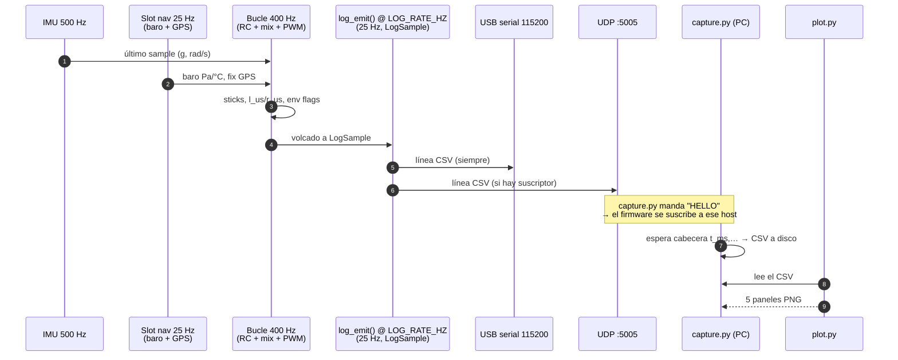
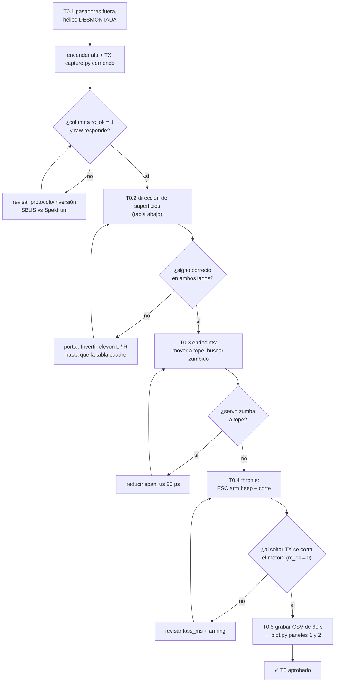
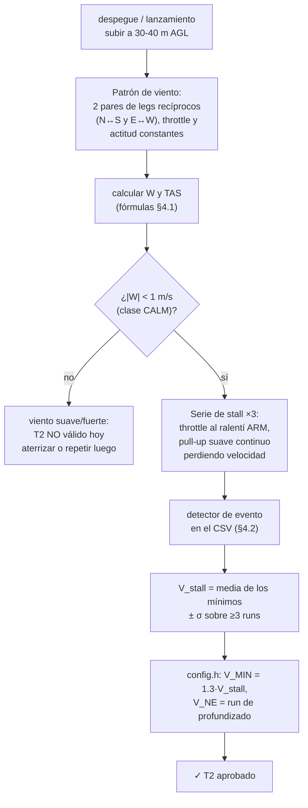
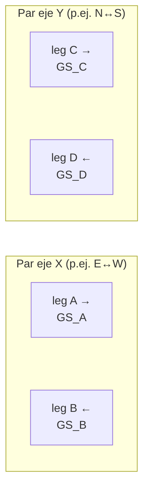
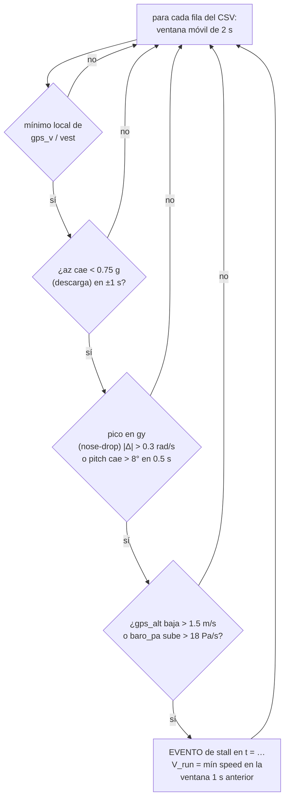
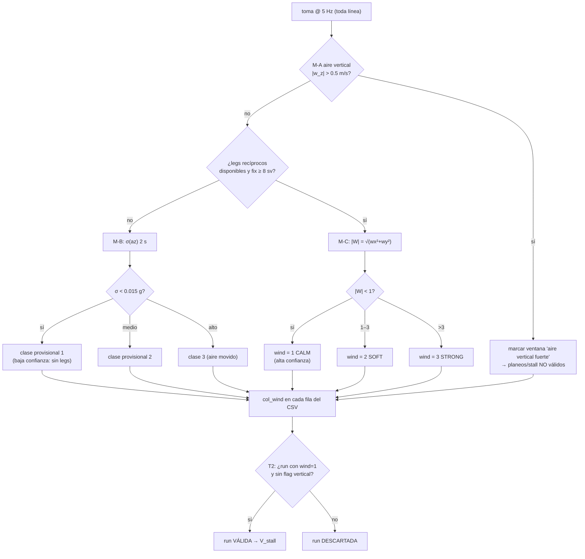

# Campaña de pruebas gráfica — logger en vivo + T0..T3

> **Qué es**: cómo registrar el ala **en tiempo real**, y el plan de pruebas
> por etapas: **T0** banco (RX → mezcla de 2 servos), **T1** planeo sin
> motor, **T2** vuelo de velocidad de pérdida con GPS (sin pitot), y **T3**
> clasificador de viento con IMU+barómetro para saber si una medición es
> válida. Todo con diagramas, fórmulas y qué mirar en las gráficas.
>
> **Companion**: los números físicos del ala van en
> `docs/airframe-measurements.md` (§A). Este documento es el **procedimiento**
> de vuelo y banco.
>
> **Estado del código** (commit de esta iteración): logger ✓, passthrough ✓
> (default ON), columna `wind` pre-cableada ✓; clasificador T3 = diseño
> (implementar al tener los primeros logs, checklist F6).

---

## 1 — Logger en tiempo real (checklist I3)

### Arquitectura



- **Formato**: una fila CSV de **39 columnas** por tick, cabecera `t_ms,…`
  impresa al arrancar (la detecta `capture.py`).
- **Ritmo**: `LOG_RATE_HZ = 25` → ~300 B × 25 = **7.5 kB/s** < 11.5 kB/s que
  da 115200 baud (35 % de holgura). Si subes el ritmo, sube el baud
  (`Serial.begin(921600)` — los CP2102/CH340 de los DevKit lo soportan).
- **Suscripción UDP**: el firmware escucha en `LOG_UDP_PORT` (5005); cualquier
  datagrama ("HELLO") suscribe a ese emisor. Mientras `capture.py` reenvíe
  HELLO cada 5 s (default), el stream sigue vivo. En el AP del ala:
  `192.168.4.1:5005`.

### Columnas del CSV

| Grupo | Columnas | Qué valida / para qué |
|---|---|---|
| Tiempo/estado | `t_ms, mode, armed, rc_ok, phase, fs_evt, env, wind` | `mode 1` = passthrough; `env` bits: 1 stall, 2 banca, 4 VNE, 5 g; `wind` = clase T3 (0 hasta F6) |
| Mando | `rc_p, rc_r, rc_t, rc_y` (normalizado) + `raw_p, raw_r, raw_t, raw_y` (unidades del protocolo) | T0: curvas/expo del TX, endpoints, deadband. `raw` SBUS 172..1811, Spektrum 0..1023 |
| IMU | `ax, ay, az` (g), `gx, gy, gz` (rad/s) | T3 turbulencia, detector de stall (nose-drop en `gy`), M7 signos |
| Barómetro | `baro_pa, baro_c` | T3 aire vertical, caídas rápidas |
| Actitud | `roll, pitch, yaw` (°) | M7 signos, banca en patrón de T2 |
| GPS | `fix, sv, hdop, gps_v, gps_alt, gps_trk` | **T2: velocidad para V_stall**, validez del fix |
| Control/salida | `vest, phi_cmd, l_us, r_us, thr_out, overruns` | T0 signos de mezcla, saturaciones; `overruns` = salud del bucle |

### Cómo usarlo (tutorial)

```bash
# 1) capturar — por USB (banco, cable):
python3 tools/wing_logger/capture.py --port /dev/tty.usbserial-0001 -o T0_bench.csv

# …o por WiFi (ALA en AP, sin cable; HELLO automático cada 5 s):
python3 tools/wing_logger/capture.py --udp 192.168.4.1:5005 -o T2_vuelo.csv

# 2) graficar (5 paneles, sale PNG o ventana interactiva):
python3 tools/wing_logger/plot.py T0_bench.csv --out T0_bench.png
```

`capture.py` imprime cada 5 s: líneas, Hz reales y **huecos** (>3× periodo =
tick perdido). Si la cabecera no aparece: reiniciar la placa con la captura
ya corriendo (la cabecera se emite en `setup()`).

### Guía de paneles de `plot.py` (el "tutorial gráfico")

| Panel | Muestra | Se usa en |
|---|---|---|
| 1 | sticks `rc_*` + pasos `mode`/`armed` | T0 (curvas TX, arming), T2 (momento del pull) |
| 2 | `l_us`/`r_us` + `thr_out` | T0 signos D1, endpoints, B3 |
| 3 | `roll/pitch/yaw` + bandera `env` roja | T1 trim, T2 banca, envelope F3 |
| 4 | `gps_v`/`vest` + `gps_alt` (eje der.) | T2 velocidad de pérdida, patrón de legs |
| 5 | `az` (g) y `gy` (pitch rate) | T2 firma IMU del stall (unload + nose-drop) |

---

## 2 — T0: banco, etapa 1 (RX → mezcla de los 2 servos)

**Objetivo**: el ala responde como un planeador RC normal: sticks →
`mix_elevons` → 2 servos + ESC. Sin AHRS, sin envelope, sin RTH en el lazo.
El **expo/curvas de mando se configuran en el TX** (no en la placa).

**Configuración** (portal WiFi `wing-XXXX`):
- ☑ **Passthrough etapa 1** (default ya ON — settings `mix.passthrough`).
- `expo` del portal = **0** si las curvas las haces en el TX (no duplicar expo).
- Canales `ch_p/ch_r/ch_t/ch_y` = mapeo AETR de tu TX (por defecto 1/0/2/3).
- Protocolo: SBUS (default) o Spektrum; `sbus_inv` casi seguro marcado.



### T0.2 — Tabla de direcciones (checklist D1)

Con el mixer del firmware (`izq = pitch − roll`, `der = pitch + roll`; **µs
↑ = TE arriba** es la intención de diseño), la tabla a ver en el banco es:

| Mando (TX) | Esperado superficie IZQ | Esperado superficie DER | En el log (panel 2) |
|---|---|---|---|
| Tirar (nariz arriba, `rc_p`→+1) | **sube** | **sube** | `l_us` y `r_us` > centro |
| Empujar (nariz abajo, `rc_p`→−1) | baja | baja | ambas < centro |
| Palo a la derecha (`rc_r`→+1) | **baja** | **sube** | `l_us` < centro < `r_us` |
| Palo a la izquierda (`rc_r`→−1) | sube | baja | `l_us` > centro > `r_us` |

- Cada servo se corrige **por separado** en el portal (`Invertir elevon L/R`):
  si la fila "palo derecha" falla solo en DER, invertir solo DER.
- Verificación final fisiológica: palo a la derecha ⇒ la superficie DERECHA
  sube (menos sustentación → ala derecha baja = roll derecha) ✓.
- Registrar en el `CHECKLIST.md` D1: "izq ✅ der ✅ con inversores en ___".

### T0.3–T0.5 — Notas

- **Curvas de mando en el TX**: expo, curve, rates — todo en el TX (pestaña
  de canal). En la placa `rc.expo` debe quedar **0** para no componer curvas.
  En el log, `rc_p` vs `raw_p` muestra la curva final (panel 1 superpone
  ambos: compara `rc_p` con la forma de `raw_p`).
- **Failsafe TX-off**: con motor al ralentí, apagar el TX → `rc_ok=0`, el
  gate de preflight desarma ⇒ `thr_out` va a `ESC_ARM_US` (motor cortado).
  **Superficies**: hoy mantienen el último mando conocido (RC loss congela
  sticks) — anotar el comportamiento observado; neutralizar superficies en
  RC-loss = pendiente H1.
- **B3 (PWM/ESC)**: beep de arm al pasar de `ESC_MIN_US` a `ESC_ARM_US`;
  si no hace beep, probar `esc_min_us` en el portal (800–1200).

---

## 3 — T1: planeo sin motor (primer contacto con el aire)

**Objetivo**: trim neutro + primer V de planeo (aprox. `V_best_glide`).

1. Lanzamiento a mano con motor **al ralentí sin armar** (los servos viven
   aunque no esté armado — el motor no gira si no arman).
2. Planeo ~5–10 s desde 10–15 m, sin corrientes fuertes (ventana T3: calma).
3. Capturar con `--udp` si da tiempo (asistencia) o USB al recuperar.
4. `plot.py` panel 3: ¿`pitch` se mantiene plano o se va a morir?
   - Se hunde la nariz → subir trim de pitch (`ml/mr_trim` en portal, 10 µs en
     cada pasada) y repetir.
   - Va de morro arriba → bajar trim.
5. Panel 4: `gps_v` medio del planeo = **primer V_measured** → comparar con
   `V_BEST_GLIDE_MPS` (13) y `V_CRUISE_MPS` de `config.h`.

**Criterio de paso**: 3 planeos seguidos con caída de nariz < 3° y sin
comando de trim cambiante → T1 ✓ (anotar `ml_trim/mr_trim` definitivos).

---

## 4 — T2: vuelo de velocidad de pérdida (V_stall con GPS, sin pitot)

**Hipótesis**: en **viento calmo** la velocidad de tierra ≈ velocidad del
aire. Midemos `gps_v` (y `vest`) en una maniobra de pérdida suave, y usamos
el clasificador **T3** para demostrar que el viento era calmo — si no lo era,
la run no vale.



### 4.1 — Patrón de viento (2 pares recíprocos) y fórmulas

Volar dos pasadas por eje, **mismo throttle, misma actitud** (la velocidad
del aire tiene que ser la misma ida y vuelta; el GPS da `gps_v` sobre
tierra y `gps_trk` la dirección):



$$w_{\parallel} = \frac{GS_A - GS_B}{2}, \qquad TAS \approx \frac{GS_A + GS_B}{2}$$

Con los dos pares: $w_x$ (par X), $w_y$ (par Y) → **vector viento**:

$$|W| = \sqrt{w_x^2 + w_y^2} \qquad TAS_{real} = \left| \vec{GS} - \vec{W}\right|$$

- Cada leg ≥ 15 s a >3 m/s de `gps_v` (proyectar `gps_v·cos(track − eje)`;
  volar recto para que `gps_v ≈` componente sobre el eje).
- Clases (Beaufort): **CALM |W| < 1**, SOFT 1–3, STRONG > 3 m/s.
- `TAS ≈ (GS_A+GS_B)/2` es la que se compara con V_stall; `gps_v` cruda
  tiene error ±|W| — **por eso** el gate CALM.

### 4.2 — Serie de stall y detector de evento

Por run (altura segura, ~30 m, campo despejado, sin gente debajo):

1. Motor ARM, throttle ~40 % hasta tener `gps_v` ≈ crucero (≥ 15 m/s).
2. Throttle → **ralentí** (mantener ARM), y empezar un **pull-up suave
   continuo** (palos de morro arriba graduales, 2–3°/s) — la velocidad se
   "cuela" mientras se mantiene o gana altura.
3. En cuanto la nariz "se abre" (nose-drop), palos a neutro y recuperar.
4. Repetir **≥ 3 runs** a la misma altura y misma actitud de entrada.

**Detector en el CSV** (automatizable sobre el CSV; umbrales iniciales —
calibrar con los logs):



- **Firma IMU clásica** (panel 5): justo antes del nose-drop, `az` se
  descarga (< 0.75 g) y `gy` hace un pico; en panel 4 `gps_v` está en su
  mínimo y `gps_alt` se va al suelo.
- **Si `mode = 0` (stabilize)** la bandera `env` bit 1 (stall) del firmware
  será el detector canónico (F3); **en passthrough (T2 etapa 1) el envelope
  está fuera del lazo** ⇒ usar el detector de arriba.
- Fórmula final:

$$V_{stall} = \mathrm{media}\left(V_{run=1..3}\right) \pm \sigma \qquad V_{MIN} = 1.3 \cdot V_{stall}$$

- `V_NE`: run separado de profundizado suave hasta el límite estructural
  estimado (o placar del fabricante) → `V_NE_MPS` (hoy 30 es placeholder).
- Guardar los CSV de T2: son la **evidencia** de §A/A6 en el checklist.

---

## 5 — T3: clasificador de viento con IMU + barómetro (+ GPS)

**Por qué**: `gps_v` solo es `V_aire` si no hay viento; el barómetro mide
"subida respecto del suelo", no del aire. Saber si volamos en aire
**calmo / suave / fuerte** decide si la run de T2 vale o no — y si el
trim/planeo se midió limpio. La columna `wind` del CSV ya existe (hoy = 0).

> ⚠️ En tierra el GPS reporta `gps_v = 0` **viento o no** — el clasificador
> solo da viento horizontal **en vuelo**. Por eso el patrón de legs (§4.1)
> corre **antes** de la serie de stall.

### Tres medidas combinadas

| # | Método | Entradas | Da |
|---|---|---|---|
| M-A | **Aire vertical**: tasa de barómetro vs tasa inercial (`∫az` con alto-paso 3–8 s, gravedad restada) | `baro_pa`, `az`, actitud | `w_z = climb_baro − climb_inertial`; `|w_z|` > 0.5 m/s ⇒ aire vertical fuerte (térmica/golpe) — **invalida planeos y pulls** |
| M-B | **Turbulencia**: σ de la aceleración específica (g restado) y de los girópescos en ventana de 2 s | `ax,ay,az,gx,gy,gz` | proxy de "aire movido" cuando no hay legs aún |
| M-C | **Triángulo de viento**:2 pares de legs recíprocos (§4.1) | `gps_v, gps_trk` | **`|W|` horizontal** (la buena) |

**Umbrales iniciales** (calibrar con los logs de T1/T2):

| Clase | `|W|` (M-C) | σ az (M-B, ventana 2 s) |
|---|---|---|
| 1 CALM | < 1 m/s | < 0.015 g (≈0.15 m/s²) |
| 2 SOFT | 1–3 m/s | 0.015 – 0.06 g |
| 3 STRONG | > 3 m/s | > 0.06 g |



**Estado actual**: `LogSample.wind` ya está en el schema (columna `wind`,
default 0 = unknown) y `plot.py` lo imprime; la lógica M-A/M-B/M-C es el
pendiente **F6** del checklist y debe codificarse **puramente** (estilo
`logger.cpp`: funciones `wind_class_*` host-testeadas) alimentada por las
filas del log — los umbrales de arriba salen de los primeros CSV de T1/T2.

---

## 6 — Checklists rápidos

### T0 (banco)
- [ ] `rc_ok=1`, `raw_*` en rango del protocolo
- [ ] Tabla de direcciones cuadra (D1) — inversores anotados en el checklist
- [ ] Endpoints sin zumbido (`span_us` ajustado)
- [ ] ESC arm beep + corte por TX-off
- [ ] CSV 60 s guardado + `plot.py` paneles 1–2 sanos (`overruns=0`)

### T1 (planeo)
- [ ] 3 planeos con trim estable
- [ ] `gps_v` de planeo anotado vs `V_BEST_GLIDE_MPS`

### T2 (stall)
- [ ] Patrón de 4 legs volado → `|W|` calculado
- [ ] `wind = 1` durante toda la serie
- [ ] ≥ 3 runs con evento detectado (§4.2)
- [ ] `V_stall` ± σ → `V_MIN_MPS = 1.3·V_stall`, run de `V_NE`
- [ ] CSVs archivados como evidencia §A/A6

### T3 (clasificador)
- [ ] `wind_class` implementado (F6), tests host
- [ ] Umbrales recalibrados con logs T1/T2
- [ ] `wind` deja de ser 0 en los CSV reales

---

## 7 — Estado y pendientes

| Pieza | Estado |
|---|---|
| CSV `logger.{h,cpp}` 39 columnas @25 Hz, host-tested | ✅ esta iteración |
| Sink USB + UDP :5005 con suscripción HELLO | ✅ |
| `capture.py` / `plot.py` (5 paneles) | ✅ `tools/wing_logger/` |
| Modo passthrough etapa 1 (default ON, portal, NVS) | ✅ |
| Columna `wind` en el schema | ✅ pre-cableada |
| Clasificador M-A/M-B/M-C (F6) | ⬜ diseño §5 — tras primeros logs |
| Ring buffer en flash (`LOG_RING_KB`, ~256 KB) para vuelos largos/sin PC | ⬜ I3 — ver CHECKLIST |
| Neutral de superficies en RC-loss (H1) | ⬜ anotar en T0.4 |
| Columna VBAT en el CSV (B4/H3) | ⬜ al caer el ADC |
